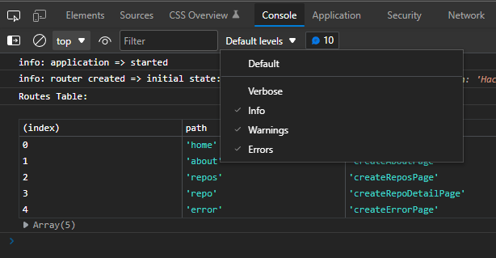

# Router Starter Project (vanilla JS)

This repo is an example of Single Page Application that uses a hash-based router, all written in vanilla JavaScript (no libraries used). It can also serve as a starter project for building your own application based on the same principles.

For the "why" of this starter repo, see: [Motivation](./MOTIVATION.md).

## Installing Dependencies

There are no dependencies needed to deploy the website, everything is prepared to work with vanilla JavaScript. However, to install the recommended ESLint and Prettier dependencies for use during development, issue the command:

```bash
npm install
```

## Code Organization

In this starter project we present a recommended folder structure and recommendations for the design of your application code.

### Folder Structure

```text
public
src
└── example
└── fetchers
└── lib
└── pages
└── views
└── app.js
└── constants.js
└── data.js
└── .secrets.js
index.html
```

> Note: Students at HackYourFuture may recognize this folder structure as similar to the recommended one for the Group Project in the Browsers module.

<!-- prettier-ignore -->
| Folder | Description |
|--------|-------------|
| `public` | This folder contains the static files that can be used by the `index.html` file. |
| `src` | This folder contains all of the JavaScript code. |
| `src/example` | Contains a fully worked-out example app that displays information about the repositories of the HackYourFuture organization. If no longer needed, this folder and its contents can be deleted. |
| `src/fetchers` | This folder contain functions that deal with fetching application data from specific urls for use by Page functions. |
| `src/lib` | This folder provides some ready-made utility functions that you can use in your application. (See later.) |
| `src/pages` | This folder contains functions that create pages to be loaded in the UI, for instance a Home page, an About page etc. Page functions return a subtree of DOM elements and contain logic to handle user interactions and, optionally, logic for fetching data from Web APIs.<br>The actual creation and update of DOM elements is preferable delegated a companion View function<sup>1</sup>.<br>A Page function is called by the router when a specific page needs to be loaded into the DOM. |
| `src/views` | This folder contains functions called upon by Page functions to create and update DOM elements, and render application data for the page. To enable user interactions, Page functions can also pass event handlers to View functions to be added as add event listeners to the View's DOM elements. |
| `app.js` |  This file contains the start-up code for the app. When using the router, this is where the router is created and attached to the DOM. |
| `constants.js` | This file contains constants for use throughout your application. |
| `data.js` | This file defines a constant holding the initial application state (if needed). |
| `.secrets.js` | This file can be used to define constants for secret API keys, etc. It is listed in `.gitignore` and will therefore not be added to your repo, which is particularly important if you publish your repo on GitHub.
| `index.html` | The one and only HTML file for the application. It includes a `<div>` element that serves as the root element for our application. It also loads the `app.js` file using a `<script>` tag with a `type="module"` attribute so that you can use ES6 `import` and `export` keywords to load additional modules.

<sup>1</sup>In support of the principle of _Separation of Concerns_.

## Utility Functions

> _Note: Throughout this README we will use the TypeScript syntax for presenting function definitions. This syntax is the same as you can see in VSCode Intellisense when you hover the mouse pointer over a function header._

Two ready-made utility functions are provided in the `src/lib` folder that you can use in your own application.

### Function: `fetchData()`

```ts
// src/lib/fetchData.js
fetchData(url: string, options?: object) => Promise<any>
```

Fetches JSON data from the Web API specified by the `url` parameter, optionally caching the response.

<!-- prettier-ignore -->
| Parameter | Description |
|-----------|-------------|
| `url` | The URL to fetch JSON data from. |
| `options` | Optional. If provided it should be an object with a boolean `cache` property that indicates whether the responses should be cached, e.g. `{ cache: true }`. |

If caching is enabled, subsequent requests to the same `url` are served from the cache. This is particularly useful when using Web APIs that use request rate limiting.

### Function: `log.XXX()`

```ts
// src/lib/logger.js
log.XXX(label: any, ...args: any) => void
```

<!-- prettier-ignore -->
| Parameter | Description |
|-----------|-------------|
| `label` | A string that identifies the originator of the log message. |
| `...args` | Zero or more arguments that the logger directly passes on to `console.log()`. |

You can use the following actual log methods (in order of increasing severity):

<!-- prettier-ignore -->
| Method | Description |
|--------|-------------|
| `log.silly()` | The lowest level. For messages that you only want to show up when drilling deep down into your code. |
| `log.debug()` | For logging debug type messages. |
| `log.info()` | For logging informational messages. |
| `log.warning()` | For logging application warnings. |
| `log.error()` | For logging application errors. |
| `log.fatal()` |For logging fatal errors that prevent your app from continuing normally. |
| `log.setLevel(minLevel)` | Sets the minimum level for the logger. The `minLevel` value must be one of `'silly'`, `'debug'`, `'info'`, `'warning'`, `'error'`, `'fatal'` or `'none'`. To suppress all log messages, use the value `'none'` (default). |

You can use this family of log methods to log information to the developer console. Log messages with a level below the `minLevel` will not show up.

Note: The two other functions in `src/lib` are in support of the Advanced Application Architecture described below.

## Advanced Application Architecture

**_You can use the provided folder structure to build an application as you see fit without using any of the recommendations for application design described in this and the next sections. These recommendations are entirely optional._**

In the sections that follow we will outline architectural patterns and techniques that will help you to build a robust, maintainable Single Page Application using vanilla JavaScript, using concepts inspired by libraries/frameworks such as React and Angular.

> **Application Architecture Definition**
>
> _An application architecture describes the patterns and techniques used to design and build an application. The architecture gives you a roadmap and best practices to follow when building an application, so that you end up with a well-structured app._
>
> _Software design patterns can help you to build an application. A pattern describes a repeatable solution to a problem._
>
> Source: RedHat, [What is an application architecture?](https://www.redhat.com/en/topics/cloud-native-apps/what-is-an-application-architecture)

For this start repo we will outline patterns for standard Page and View functions, standard techniques for handling events and for fetching data. We also introduce the concept of a client-side _router_, which allows the SPA to programmatically load different pages, by applying, and responding to, changes to the browser's `location` url.

### Page functions: `createXXXPage()`

A Page function represents an application page. It is called by the router to create the page when the user navigates to it. After the page is created, the router loads its DOM subtree into the DOM.

A Page function is responsible for handling all user interactions for the page and for fetching any required data from Web APIs. It is not (should not be) responsibly for the creation and updating of the actual DOM elements. This should (preferably) be delegated to a companion View function.

The function signature for a Page function is as follows:

```js
createXXXPage(...params: any) => { root: HTMLElement, update?: Function }
```

<!-- prettier-ignore -->
| Parameter | Description |
|-----------|-------------|
| `...params` | Any parameters encoded in the browser's location url will be passed to the Page function. |

A Page function should return an object with, at minimum, a `root` property holding a reference to the root element of its DOM subtree, and optionally an `update` property holding a reference to callback function that is called whenever the application state is updated (see below). This requirement is met if the Page function simply returns the object returned by its View function.

The name of a Page function should follow the naming convention **create**_XXX_**Page**, where _XXX_ is the name of the View. Example: `createAboutPage`.

The standard pattern for a Page function is similar to:

```js
import createSampleView from '../views/sampleView.js';

function createSamplePage() {
  const props = {
    // Add properties to be passed to the View function
  };
  const sampleView = createSampleView(props);

  // Place any code needed to initialize the page, e.g. to fetch data, here.

  // Return the object containing the root DOM element for this page to the
  // the router.
  return sampleView;
}

export default createSamplePage;
```

A Page function can pass event handlers to the View function through the `props` object. The View function can then add the event handler to the target DOM elements by calling `.addEventListener()` on the elements.

```js
import router from '../../lib/hashRouter.js';
import createAboutView from '../views/aboutView.js';

function createAboutPage() {
  const props = { onClick: () => router.navigateTo('home') };
  return createAboutView(props);
}
```

### View functions: `createXXXView()`

The function signature for a View function is as follows:

```js
createXXXView(props?: object) => { root: HTMLElement, update?: Function }
```

<!-- prettier-ignore -->
| Parameter | Description |
|-----------|-------------|
| `props`   | On object with properties that hold values and/or event handler functions to be used when creating the View's DOM elements. |

View functions are used to create and update DOM elements in the service of corresponding Page functions. A View function can render application data and add any event handlers passed to it through the `props` parameter. It can respond to `state` updates by providing and returning an `update()` callback function through its return object.

The name of a View function should follow the naming convention **create**_XXX_**View**, where _XXX_ is the name of the View. Example: `createAboutView`.

A View function typically first creates an initial DOM element that represents the `root` element of the View's DOM subtree. It can then add child elements to that root through its `.innerHTML` property.

> Warning: You should not use `.innerHTML` for production applications. There are potential security issues associated with its use. However, since you are expected to later switch to established libraries, such as React (which uses HTML-like syntax called JSX), we have in this starter repo opted to take advantage of the simplicity and convenience that `.innerHTML` provides for defining HTML structures.<br>
> For more info on the security issues associated with `.innerHTML`, see [Security considerations](https://developer.mozilla.org/en-US/docs/Web/API/Element/innerHTML#security_considerations) on the MDN web site.

Here is an example of a View function.

```js
function createAboutView(props) {
  const root = document.createElement('div');
  root.className = 'dialog-container centered';
  root.innerHTML = String.raw`
    <h1>Router Starter Application</h1>
    <p>This starter application implements and demonstrates a standard 
      application architecture, featuring a hash-based router.
    </p>
    <div class="button-container">
      <button type="button" id="btn-home">Home</button>
    </div>
  `;

  const homeButton = root.querySelector('#btn-home');
  homeButton.addEventListener('click', props.onClick);

  return { root };
}

export default createAboutView;
```

> Tip: There is a handy VSCode extension that adds syntax coloring to JavaScript string templates if they contain HTML code. It also adds [emmet](https://emmet.io/) support. Install this extension and then mark your HTML string templates with `String.raw` to enable the magic.<br>
> Find it here: [Visual Studio Marketplace: lit-html](https://marketplace.visualstudio.com/items?itemName=bierner.lit-html)

A View function should return an object that contains a property for its `root` element and, optionally, a property for its `update()` callback function.

Inside the View function you can access child elements from its `root` element by calling `.querySelector()` on it, as is done in this example to add an event handler function passed as a prop to the button.

Note that access to DOM elements should be restricted to the View functions where they are created. This helps to ensure Separation of Concerns, a key principle in software design.

A View function may call other View functions and incorporate their root elements as child elements of its own DOM subtree.

> What you should **_not_** do is access DOM element (e.g. by using `document.getElementById()` or `document.querySelector()`) outside of the View function where the DOM elements are created. This would be a violation of the architectural principles outlined here and because of it breaking the rules, introduce a potential maintenance issue. If you find yourself needing to violate this rule you probably need to rethink the way you have organized your pages and views.

#### The `update()` callback

A View function can return an optional `update()` callback function for updating the view after changes have been made to the global app state. The global app state takes the form of a JavaScript object that is passed as argument to the `update()` callback.

Here is an example:

```js
// file: src/examples/views/toolbarView.js
function createToolbarView(props) {
  const root = document.createElement('div');
  root.className = 'toolbar-view';
  root.innerHTML = String.raw`
    <div>Filter:</div>
    <input type="text" class="filter-input"/>
    <button type="button" id="btn-clear" disabled>Clear</button>
    <div>GitHub:</div>
    <select id="select-org">
      <option value="HackYourFuture">HackYourFuture</option>
      <option value="HackYourHomework">HackYourHomework</option>
    </select>
  `;

  const filterInput = root.querySelector('.filter-input');
  filterInput.addEventListener('input', props.onFilterInput);

  const btnClear = root.querySelector('#btn-clear');
  btnClear.addEventListener('click', props.onClearFilter);

  const selectOrg = root.querySelector('#select-org');
  selectOrg.addEventListener('change', props.onOrganizationChange);

  const update = (state) => {
    filterInput.value = state.filter || '';
    selectOrg.value = state.organization;
    btnClear.disabled = !state.filter;
  };

  return { root, update };
}
```

The UI rendered by this View function looks like this:


The `update()` function is used here to update the values of organization `<select>` element and the `<input>` element and to disable the **Clear** `<button>` if the filter field is empty.

The `input` element is completely controlled through code (in React this is called a _controlled component_). For instance, the `onFilterInput()` event handler ignore any leading and/or trailing spaces and convert any uppercase letters to lowercase. Then, the `input` element's value attribute is updated accordingly.

#### Fetching data in a Page function

Here is an example of recommended practice for fetching data from a Web API inside a Page function.

```js
// file: src/examples/pages/reposPage.js
function createReposPage(state) {
  const props = {
    // ...
  };

  const reposView = createReposView(props);

  const getData = async () => {
    router.updateState({ error: null, loading: true, repos: null });

    try {
      const repos = await fetchRepos(router.getState().organization);
      router.updateState({ repos, loading: false });
    } catch (error) {
      log.error('createReposPage', error.message);
      router.updateState({ error, loading: false });
      navigateTo('error');
      return;
    }
  };

  getData();

  return reposView;
}
```

Page functions are _not_ called asynchronously by the router. However, data fetches _must_ be done asynchronously. Therefore, the recommended practice is to either use use an async IIFE or an internal async function (as is used here) to fetch the data.

In this example, before calling the async function that actually fetches the data we update the global app state by calling the `router.updateState()` method, passing an object with relevant changes we want to make to the state.

The `update()` callback from the View will be called by the router with the update state object. In this example the View will act on the changes by showing a spinner to signal to the user that data is being loaded.

If the data is successfully fetched we want to hide the spinner and render the fetched data. Therefore we set we update the state again so that the View can hide spinner and render the data now available in the state object.

If an error was encountered we set the state accordingly and, in this case, continue by navigating to an error page and returning early from the Page function.

In the corresponding View function the `update()` callback function typically handles the loading and render phases as follows:

```js
// file: src/examples/views/repoDetailView.js
const update = (state) => {
  if (state.loading) {
    loadingIndicator.root.hidden = false;
    return;
  }

  loadingIndicator.root.hidden = true;

  if (state.error) {
    return;
  }

  const { repo, contributors } = state;

  // Code that follows (omitted) renders the fetched data to the DOM.
};
```

## Router

The purpose of a (client-side) router in a Single Page Application is to let the client programmatically load different application 'pages' into the DOM by manipulating the browser's location url. In a hash-based router, the specific page to load is determined by the `hash` fragment of the url. In a url, a hash fragment is the part that starts with a `#` mark. Everything following the `#` mark is considered part of the hash.

We can use the hash to specify the name of the page to load and can optionally include parameters to pass to the Page function. It can be said that the url when used in such a way is part of the application state.

A hash-based router uses an event listener to listen for hash changes and responds to those changes by loading a matching page (see **Implementation** below).

Example of a hash with a page name and two parameters.

```text
#repo/UsingAPIs
```

This hash identifies a page named `repo` and two string parameters to be passed to the Page function: `"HackYourFuture"` and `"UsingAPIs"`. The router will call the corresponding Page function effectively like this:

```js
createRepoDetailPage(state, 'HackYourFuture', 'UsingAPIs');
```

## Pros and cons of a hash-based router

The hash fragment in a url is not considered part of the web address. The browser only uses the url parts preceding the hash when making an HTTP request to load an HTML page. In a Single Page Application that uses a hash-based router you can therefore do the following without the need for backend support:

- You can reload the browser and return to the same application page as specified by the hash. If the parameters required to fetch data are supplied in the hash then that data is re-fetched automatically too.
- You can bookmark an application url and return to the same page in the future.
- You can send the url to a friend who then lands on the expected application page.

The downside of a hash-based router is that the url looks 'funny' because of the hash. It also possible to use a client-side router with regular urls (no hash), however that requires backend support to ensure that always the same `index.html` file loaded, regardless of the presence of additional parameter fragments in the url in addition to the base url.

### Implementation

The router is created in `src/lib/router.js` and is exported as an object with the following methods:

```js
{
  start: (routes: Route[], routerOutlet: HTMLElement, state?: object) => void,
  navigateTo:  (pageName: string, ...params: string[]) => void;
  updateState: (updates: object) => void;
  getState: () => object;
}
```

#### Method: `router.start()`

This method starts the router.

```js
router.start(routes: Route[], routerOutlet: HTMLElement, state?: object) => void
```

<!-- prettier-ignore -->
| Parameter | Description |
|-----------|-------------|
| `routes` | An array of route definitions.|
| `routerOutlet` | The DOM element into which pages should be loaded. |
| `state` |  The initial application state. Optional. Defaults to an empty object. |

Here is an examples `routes` array of route objects as used in this starter project:

```js
// file src/example/pages/routes.js
const routes = [
  { path: 'home', page: createHomePage, default: true },
  { path: 'about', page: createAboutPage },
  { path: 'repos', page: createReposPage },
  { path: 'repo', page: createRepoDetailPage },
  { path: 'error', page: createErrorPage },
];
```

A route object contains the following properties:

<!-- prettier-ignore -->
| Property | Description |
|----------|-------------|
| `path` | The name of the page to load. |
| `page` | The Page that should be called to create that page. |
| `default` | If `true`, this route will be used if there is no hash present in the browser's url or if the hash does not represent a known path. The router will use the first route it find marked as default. |

#### Method: `router.navigateTo()`

To navigate to a specific page, we can use the `navigateTo()` method.

```ts
router.navigateTo(path: string, ...args: any) => void
```

<!-- prettier-ignore -->
| Parameter | Description |
|-----------|-------------|
| `path` | The path (i.e. name) of the page to load. |
| `...args`  | Zero or more arguments to be passed to the target Page function. |

The `navigateTo()` method encodes the path and optional arguments into a string and assigns it to the browser's location hash. This will trigger hash change event that the router will pick up.

The main code of the router is inside the function `createRouter()`. Below is a (simplified) part of the code that illustrates how the router works.

```js
// file: src/lib/router.js
const createRouter = () => {
  //...
  window.addEventListener('hashchange', () => {
    // Search the routes table for the route corresponding to the path name.
    const route = findRouteByPathname(pathname);
    // Call the Page function to create the page.
    const { root } = route.page(state, ...params);
    // Mount the page in the DOM, removing any previous page.
    clearElement(routerOutlet);
    routerOutlet.appendChild(root);
  });
  //...
};
```

> Tip: You can follow what happens in the application when you navigate through the app by opening the developer console and examining the debug messages. (_Always open the developer console when you are developing!_)
>
> If you are no longer interested in these messages (e.g. when deploying your app) change the minimum log level in `./src/constants.js` to `'fatal'`.
>
> You may need to change the default level of the browser console to **Verbose** to see all messages:
>
> 

## Using this starter for your own project

1. Fork this repo and clone it on your computer.
2. In `src/app.js`, change the `import` statement to load the `routes` table from `./pages/routes.js` instead of `./example/pages/routes.js`.

   ```js
   import routes from './pages/routes.js';
   ```

3. Load the application in your browser. You should now see the message from the Home Page: **It works!**.

4. Change the Home Page and View functions in the `src/pages` and `src/views` folders as required for your app.

5. Add further Page, View and helpers function as needed. Update the routes table in `src/page/routes.js` to add routes for the new pages.

6. If in doubt how to achieve some specific functionality, examine the `example` folder for possible approaches.
