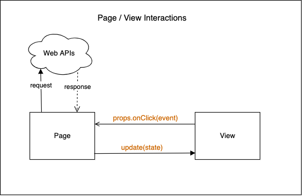

# Vanilla Starter Project

This repo provides a couple of examples of Single Page Applications (SPAs), all written in vanilla JavaScript (no libraries used). This same repo also serves as a GitHub template for generating a starter repo to build your own application based on the principles outlined in this README.

Live demo: <https://remarcmij.github.io/vanilla-starter/>

**TL;DR** To find out how use this repo for your own project, go **[here](#5-using-this-starter-for-your-own-project)**.

## 1. Installation

### 1.1. Install dependencies

To install the recommended ESLint and Prettier dependencies for use during development, please issue the command:

```bash
npm install
```

### 1.2 Recommended VSCode Extensions

When you load the repo folder in VSCode, you may notice that there are some recommendations for VSCode extensions for use with this repo. Please consider installing these extensions.

## 2. Code Organization

In this starter project we present a recommended folder structure and recommendations for the design of your application code.

### 2.1 Folder Structure

```text
public
src
└── examples
└── fetchers
└── lib
└── pages
└── views
└── app.js
└── constants.js
└── index.js
└── .credentials.js
index.html
```

<!-- prettier-ignore -->
| Folder | Description |
|--------|-------------|
| `public` | This folder contains the static files that can be used by the `index.html` file. |
| `src` | This folder contains all of the JavaScript code. |
| `src/examples` | This folder contains a couple of fully worked-out examples that were built using the principles that are outlined in this document. If no longer needed, this folder and its contents can be deleted. |
| `src/fetchers` | This folder contain functions that deal with fetching application data from specific urls for use by Page functions. |
| `src/lib` | This folder provides some ready-made utility functions for advanced features that may consider as your application grows. See [Further Reading](#4-further-reading) below for more information. |
| `src/pages` | This folder contains functions that create pages to be loaded in the UI, for instance a Home page, an About page etc. Page functions return a subtree of DOM elements and contain logic to handle user interactions and, optionally, logic for fetching data from Web APIs.<br>In a multi-page application<sup>1</sup> a Page function is called by the router when the user navigates to the corresponding page. In a single-page application the one and only Page function is called from within `app.js`. |
| `src/views` | This folder contains functions called upon by Page functions to create a subtree of DOM elements and update the subtree as the application state changes. |
| `src/app.js` |  This file contains the start-up code for the app. When using the router, this is where it is created and attached to the DOM. |
| `src/constants.js` | This file contains constants for use throughout your application. |
| `src/index.js` | This file contains the main entry point for your application. |
| `src/.credentials.js` | This file can be used to define constants for secret API keys, etc. It is listed in `.gitignore` and will therefore not be added to your repo, which is particularly important if you publish your repo on GitHub. This file is not included in the repo (exactly because it is git-ignored), but an example is provided as `.credentials.example.js` |
| `index.html` | The one and only HTML file for the application. It includes a `<div>` element that serves as the root element for our application. It also loads the `app.js` file using a `<script>` tag with a `type="module"` attribute so that you can use ES6 `import` and `export` keywords to load additional modules.

Notes:

1. We are referring here to multiple _client-side_ pages. The application itself is still a Single Page Application, in that there is only a single HTML file, which is loaded once only. It's DOM tree is subsequently modified by means of JavaScript to make it appear as if it contains multiple pages.

## 3. Starter Application Architecture

In the sections that follow we will outline architectural patterns and techniques that will help you to build a robust, maintainable Single Page Application with vanilla JavaScript, using concepts inspired by libraries/frameworks such as React and Angular.

> **Application Architecture Definition**
>
> _An application architecture describes the patterns and techniques used to design and build an application. The architecture gives you a roadmap and best practices to follow when building an application, so that you end up with a well-structured app._
>
> _Software design patterns can help you to build an application. A pattern describes a repeatable solution to a problem._
>
> Source: RedHat, [What is an application architecture?](https://www.redhat.com/en/topics/cloud-native-apps/what-is-an-application-architecture)

An application architecture also serves as a common vocabulary to communicate with other developers and teams. Those developers and teams will expect to find these rules and patterns being applied in in your application. To meet these expectations it is important for you to follow them as closely as possible.

For the architecture at hand, we will outline patterns for standard Page and View functions, how to manage application state and standard techniques for handling events and for fetching data.

## 3.1 The Page/View/State Model

Figure 1 below gives a high-level overview of the core application architecture used throughout this starter repo. We will refer to it as the **Page/View/State Model**. In its simplest form, an application following this architecture is made up of a Page object, a View object and a state object. All three object are regular JavaScript objects.

<br>
Figure 1: **The Page / View / State Model**

### 3.2 Code Example

Perhaps the quickest way to understand the Page/View/State model is to look at a code example for a mini application that uses this model. In this mini application, the **Increment** button increments the counter by 1 and the **Decrement** button decrements it by 1. The application prevents the counter to go below 0 by disabling the **Decrement** button when the counter is 0.

<br>
Figure 2: **Mini Application UI**

Figure 3 below gives an overview of the complete JavaScript code for this mini application. We will look in detail at the `homePage.js` and `homeView.js` files in the next section. The other two files should speak for themselves.

<br>
Figure 3: **Mini Application JavaScript Code**

### 3.2.1 homeView.js

Code: [homeView.js](./src/views/homeView.js)

It is perhaps best to start our discussion with the View object of our Page/View/State model. In our mini application example this object is created in the `homeView.js` file (top-left in Figure 3). This file exports a single function named `createHomeView()` which takes a single argument `props` (short for _properties_) and returns a View object: `{ root, update }`.

The names `homeView.js` and `createHomeView` are chosen to conform to a naming standards prescribed by the Application Architecture followed throughout this starter repo. The generic forms for a View are **xxxView.js** for the filename and **createXXXView** for the function, where **XXX** is the name of the Page/View.

The **createXXXView()** function, which we will simply refer to as "View function" from this point forward, does the following:

1. It creates a subtree of DOM elements which will be used to render the page.
2. It attaches event handler functions passed to it through the `props` argument to the relevant DOM element.
3. It defines an internal `update()` function which can be called by the Page object to update the DOM elements of the view.
4. It returns an object that holds references to both the root element of DOM subtree and to the internal `update()` function. This object is called a View object.

Note that the View function creates a closure: the internal `update()` function has access to all the variables in the scope of the View function.

### 3.2.2 homePage.js

Code: [homePage.js](./src/pages/homePage.js)

This file exports a function that returns a Page object, representing an application page. A Page function should, again by convention, conform to the naming standard **createXXXPage** for the function name and **xxxPage.js** for its filename.

In the simplest scenario (as is the case here), a Page object is identical to a View object. That's why the `createHomePage()` function in our example simply returns the View object returned by `createHomeView()`.

Let's walk through the code a little bit more closely.

<!-- prettier-ignore -->
| Line(s) | Description |
| :-----: | ----------- |
| 1 | The Page function is the one and only importer of the View function. It can be regarded as its owner. |
| 4 | The `state` object represents the State part of our Page/View/State model. In this example, our entire application state consists of just simple counter, which is initialized to 0. |
| 6-13 | The `onIncrement()` and `onDecrement()` functions are event handler functions that will be passed to the View through its `props` argument (here called `viewProps`. The event handlers update the state object and call the View's `update()` method to give the View an opportunity to update its DOM subtree. |
| 7, 12 | A special note with respect to how the state is updated: this is done by creating a new `state` object rather than mutating the existing one (e.g. by using `state.counter++`). While this may seem overly complex here, it becomes essential when using libraries such as React. That's why it is useful to get used to this practice of handling 'state' from the start. |
| 16-17 | The event handler functions are passed to the View function through the `viewProps` argument. |
| 19 | After the View is created, the View's `update()` method is called. Since the counter starts at 0 we want to View to disable its **Decrement** button. This call to `update()` lets the View take care of that. |
| 21 | We return a Page object which in this case is identical to the View object returned by the View function. |

Finally, the `root` property of the Page object is used in `app.js` to insert the DOM subtree of the Page into the document's DOM.

### 3.3 Division of Responsibilities: Page vs View

> All the example applications in this repo strictly follow the principles outlined in this section. There should be no reason to deviate from these principles in your own application.

#### 3.3.1 Page

- The Page function is responsible for handling all user interactions with the page and for updating the state object with any changes caused by these interactions. If appropriate, it should call the `update()` method of its subordinate View, passing the updated state object as argument.

- DOM event handlers should be defined as internal functions of the Page function and be passed as props to the View function.

- Network requests should be handled by the Page function, either when the page is initially created and/or as a response to user interactions with the page.

#### 3.3.2 View

- The View function is responsible for creating the page's DOM subtree and, if appropriate, for updating the DOM subtree depending on the state passed to its `update()` method.

#### 3.3.3 Interactions

- All communication from the Page to View should be done from within the Page function by calling the `update()` function of the View, passing an updated state object as an argument.

- All communication from the View to Page should be done by means of event handlers, passed as props to the View function. For example, in Figure 4 below, a `"click"` event handler inside the Page function, passed as props to the View, is called when a `"click"` event is triggered by an element of the View's DOM subtree.

<br>
Figure 4: **Page/View Interaction**

#### 3.3.4 Architectural Violations

Here is a list of examples of things that would considered architectural violations:

- Access DOM elements outside of the View function, e.g. by using `document.getElementById()` or `document.querySelector()`. The View function should have exclusive access to its DOM subtree.
- Handling events inside a View function. Events should be handled inside the Page function.
- Mutating or updating the state object inside a View function. Inside a View function it should be considered readonly.
- Exporting anything other the `createXXXPage()` function from a Page module.
- Exporting anything other than the `createXXXView()` function from a View module.
- Adding more parameters than those documented here to the `createXXXPage()`, `createXXXView()` or `update()` functions.

## 4. Further Reading

<!-- prettier-ignore -->
| Topic | Link |
| ----------- | ---- |
| Creating a multi-page SPA with a client-side router. | [Router](docs/ROUTER.md) |
| Managing global application state in a multi-page SPA using Observable State. | [State](docs/STATE.md) |
| Miscellaneous utility functions from the `lib` folder that you might find handy for use in your application. | [Utilities](docs/UTILITIES.md) |
| An overview of the example applications from the `examples` folder that follow the described Application Architecture. | [Examples](docs/EXAMPLES.md) |
| Recipes for common task in the Application Architecture. | [Recipes](docs/RECIPES.md) |

## 5. Using this Starter for Your Own Project

1. In GitHub, click on the **Use this template** button to generate a repository on your own GitHub account using the files of this repo.

2. Clone the generated repo from your own GitHub account to your local computer.

3. Run `npm install` to install all the dependencies. Remember also to install the recommended VSCode extensions.

4. In `src/index.js`, uncomment the import of `./app` and comment out the import of `./examples/...`. (When you no longer need the examples, you can remove this line and remove the `examples` folder altogether.)

   ```js
   // import loadApp from './examples/menu/app.js';
   // ...
   import loadApp from './app.js';
   ```

5. Load the application in your browser. You should now see the message from the Home Page as shown in Figure 1 of [3.2 Code Example](#32-code-example).

6. Change the Page and View functions in the `src/pages` and `src/views` folders as required for your app.

7. In `src/index.html`, modify the contents of the `<head>` as you see fit, taking out no longer needed style sheets and adding in your own.

That's it! You should now be able to build your own SPA using the Application Architecture described in this document.
