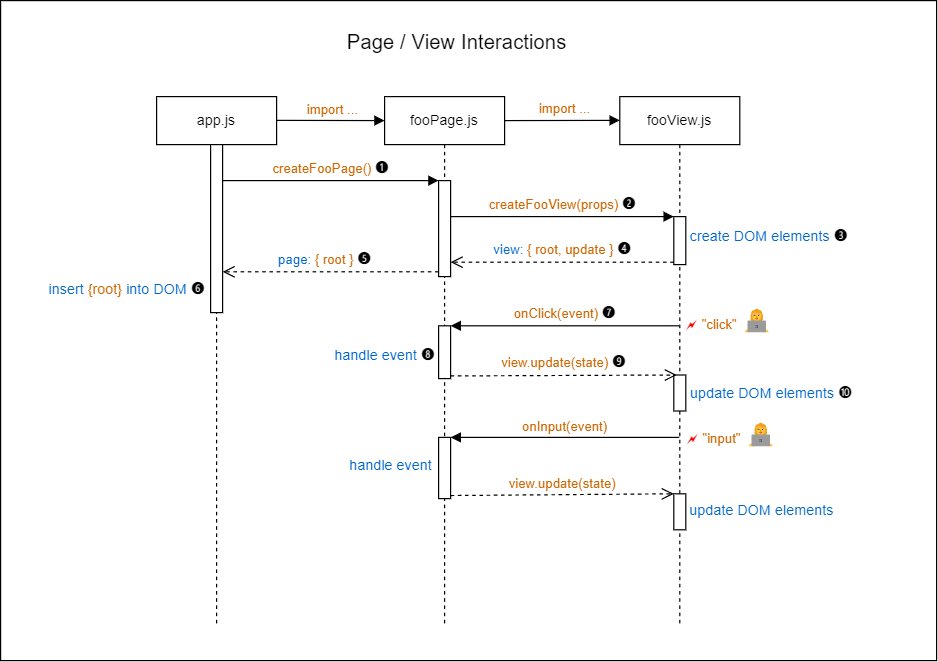

# Vanilla Starter Project

Live demo: <https://remarcmij.github.io/vanilla-starter/>

**TL;DR** To find out how use this repo for your own project, go **[here](#using-this-starter-for-your-own-project)**.

This repo is an example of Single Page Application that uses a hash-based router, all written in vanilla JavaScript (no libraries used). It can also be used as a template for generating a starter repo for your own application based on the principles outlined in this README.

## Installing Dependencies

To install the recommended ESLint and Prettier dependencies for use during development, issue the command:

```bash
npm install
```

## Code Organization

In this starter project we present a recommended folder structure and recommendations for the design of your application code.

### Folder Structure

```text
public
src
└── examples
└── fetchers
└── lib
└── pages
└── views
└── app.js
└── constants.js
└── index.js
└── .credentials.js
index.html
```

> Note: Students at HackYourFuture may recognize this folder structure as similar to the one introduced in the Group Project of the Browsers module.

<!-- prettier-ignore -->
| Folder | Description |
|--------|-------------|
| `public` | This folder contains the static files that can be used by the `index.html` file. |
| `src` | This folder contains all of the JavaScript code. |
| `src/examples` | This folder contains a couple of fully worked-out examples that were built using the principles that are outlined in this document. If no longer needed, this folder and its contents can be deleted. |
| `src/fetchers` | This folder contain functions that deal with fetching application data from specific urls for use by Page functions. |
| `src/lib` | This folder provides some ready-made utility functions that you can use in your application. (See below.) |
| `src/pages` | This folder contains functions that create pages to be loaded in the UI, for instance a Home page, an About page etc. Page functions return a subtree of DOM elements and contain logic to handle user interactions and, optionally, logic for fetching data from Web APIs.<br>The actual creation and update of DOM elements can be delegated a companion View function<sup>1</sup>.<br>A Page function by the router when a specific page needs to be loaded into the DOM. When not using a router, it can also be called manually (for example of where this is done, see `app.js` from the `pokemons` example). |
| `src/views` | This folder contains functions called upon by Page functions to create a subtree of DOM elements and update the subtree as the application state changes. To enable user interactions, Page functions can also pass event handler functions to View functions to be added as event listeners to the View's DOM elements. |
| `app.js` |  This file contains the start-up code for the app. When using the router, this is where it is created and attached to the DOM. |
| `constants.js` | This file contains constants for use throughout your application. |
| `index.js` | This file contains the main entry point for your application. |
| `.credentials.js` | This file can be used to define constants for secret API keys, etc. It is listed in `.gitignore` and will therefore not be added to your repo, which is particularly important if you publish your repo on GitHub. This file is not included in the repo (exactly because it is git-ignored), but an example is provided as `.credentials.example.js` |
| `index.html` | The one and only HTML file for the application. It includes a `<div>` element that serves as the root element for our application. It also loads the `app.js` file using a `<script>` tag with a `type="module"` attribute so that you can use ES6 `import` and `export` keywords to load additional modules.

<sup>1</sup>In support of the principle of _Separation of Concerns_.

## Advanced Application Architecture

**_You can use the provided folder structure to build an application as you see fit without using any of the recommendations for application design described in this and the next sections. These recommendations are entirely optional._**

In the sections that follow we will outline architectural patterns and techniques that will help you to build a robust, maintainable Single Page Application using concepts inspired by libraries/frameworks such as React and Angular.

> **Application Architecture Definition**
>
> _An application architecture describes the patterns and techniques used to design and build an application. The architecture gives you a roadmap and best practices to follow when building an application, so that you end up with a well-structured app._
>
> _Software design patterns can help you to build an application. A pattern describes a repeatable solution to a problem._
>
> Source: RedHat, [What is an application architecture?](https://www.redhat.com/en/topics/cloud-native-apps/what-is-an-application-architecture)

An application architecture also serves as a common vocabulary to communicate with other developers and teams. Those developers and teams will expect to find the rules and patterns back in your application. To meet these expectations it is important for you to apply them as closely as possible.

For architecture at hand, we will outline patterns for standard Page and View functions, standard techniques for handling events and for fetching data. We also introduce the concept of a client-side **router**, which allows the SPA to programmatically load different pages, by applying, and responding to, changes to the browser's `location` url.

Let's start with Page functions.

### Page functions: `createXXXPage()`

A Page function creates an application page. In an application that consist of a single page only there will be just one Page function. It will typically be called in the main `app.js` file where its returned DOM subtree will be added to the existing root `<div>` element in the `index.html` file.

In an application with multiple client-side pages a **router** manage the calling of a Page function whenever the user navigates to the corresponding page. After the page is created, the router loads its DOM subtree into the DOM, replacing the DOM subtree of any previous page.

A Page function is responsible for handling all user interactions for the page and for initiating and handling the fetching of data from Web APIs where required. Unless the page is very simple, the creation and updating of DOM elements is normally delegated to a companion View function, which is then called by the Page function.

The name of a Page function should follow the naming convention **create**_XXX_**Page**, where _XXX_ is the name of the Page. Example: `createAboutPage`. Each Page function should be in a separate file, named `xxxPage.js`, e.g., `aboutPage.js`.

The function signature for a Page function is as follows:

> _Note: Throughout this README we will use the TypeScript syntax for presenting function definitions. This syntax is similar to the Intellisense that you can see when you hover the mouse pointer over a function header in VSCode._

```js
createXXXPage(...params: any) => {
  root: HTMLElement,
  pageDidLoad?: Function,
  pageWillUnload?: Function
}
```

<!-- prettier-ignore -->
| Parameter | Description |
|-----------|-------------|
| `...params` | When using a router, any parameters encoded in the browser's location url will be passed to the Page function. |

A Page function should return a JavaScript object with, with the following properties:

<!-- prettier-ignore -->
| Property | Required? | Description |
|----------|:---------:|----------|
| **`root`** | Yes | Holds a reference to the `root` element of the DOM subtree created by the Page function (or created by a subordinate View function called by the Page function). |
| **`pageDidLoad`** | No | If provided, it will be called by the router just after the page is loaded. |
| **`pageWillUnload`** | No | If provided, it will be called by the router just prior unloading the page, i.e. when it is about to be replaced by a new page. |

Code example: [`src/examples/github-2/pages/repoDetailPage.js`](src/examples/github-2/pages/repoDetailPage.js)

The standard pattern for a Page function is similar to:

```js
import createFooView from '../views/fooView.js';

function createFooPage() {
  const viewProps = {
    // Add properties to be passed to the View function
  };
  const view = createFooView(viewProps);

  // Place any code needed to initialize the page, e.g. to fetch data, here.

  // Return the object containing the root DOM element for this page to the
  // the router.
  return { root: view.root };
}

export default createFooPage;
```

A Page function can pass event handlers to the View function through the `props` object. The View function can then add the event handler to the target DOM elements by calling `.addEventListener()` on the elements.

```js
import router from '../../lib/router.js';
import createFooView from '../views/fooView.js';

function createFooPage() {
  const viewProps = { onClick: () => router.navigateTo('home') };
  const view = createFooView(viewProps);
  return { root: view.root };
}
```

### View functions: `createXXXView()`

The name of a View function should follow the naming convention **create**_XXX_**View**, where _XXX_ is the name of the View. Example: `createAboutView`. Each View function should be in a separate file, named `xxxView.js`, e.g., `aboutView.js`.

The function signature for a View function is as follows:

```js
createXXXView(props?: object) => { root: HTMLElement, update?: Function }
```

<!-- prettier-ignore -->
| Parameter | Description |
|-----------|-------------|
| `props`   | On object with properties that hold values and/or event handler functions to be used when creating the View's DOM subtree. |

View functions are used to create and update DOM elements in the service of corresponding Page functions or parent View functions. A View function can render application data and add any event handlers passed to it through the `props` parameter. It must return an object with the following properties:

<!-- prettier-ignore -->
| Property | Description |
|----------|-------------|
| **`root`** | Holds a reference to the `root` element of the DOM subtree created by the View function. |
| **`update`** | Optional. If provided, it should be a function that updates the DOM subtree with the latest application state information. |

A View function typically first creates a DOM element that represents the `root` element of the View's DOM subtree. It can then add child elements to that root through its `.innerHTML` property or through calls to `.appendChild()`.

> Warning: You should not use `.innerHTML` for production applications. There are potential security issues associated with its use. However, since you are expected to later switch to established libraries, such as React (which uses HTML-like syntax called JSX), we have in this starter repo opted to take advantage of the simplicity and convenience that `.innerHTML` provides for defining HTML structures.<br>
> For more info on the security issues associated with `.innerHTML`, see [Security considerations](https://developer.mozilla.org/en-US/docs/Web/API/Element/innerHTML#security_considerations) on the MDN web site.

Here is an example of a simple View function.

```js
function createFooView(props) {
  const root = document.createElement('div');
  root.className = 'dialog-container';
  root.innerHTML = String.raw`
    <h1>${props.text}</h1>
  `;

  return { root };
}

export default createFooView;
```

> _Tip: There is a handy VSCode extension that adds syntax coloring to JavaScript string templates if they contain HTML code. It also adds [emmet](https://emmet.io/) support. Install this extension and then mark your HTML string templates with `String.raw` to enable the magic.<br>
> Find it here: [Visual Studio Marketplace: lit-html](https://marketplace.visualstudio.com/items?itemName=bierner.lit-html)_

Inside the View function you can access child elements the `root` element by calling `.querySelector()` on it, or by using the provided utility function `findElementsWithIds()` (see below).

A View function may call other View functions and incorporate their root elements as child elements of its own DOM subtree.

> _What you should **not** do is access DOM element (e.g. by using `document.getElementById()` or `document.querySelector()`) outside of the View function where the DOM elements are created. This would be a violation of the architectural principles outlined here and because of it breaking the rules, introduce a potential maintenance issue. If you find yourself needing to violate this rule you probably need to rethink the way you have organized your pages and views._

#### The `update()` callback

A View function can return an optional `update()` callback function that can be called to update the view after changes have been made to the application state. The application state is held in a JavaScript object that is passed as argument to the `update()` callback.

Here is an example:

File: [src/examples/github-2/views/toolbarView.js](src/examples/github-2/views/toolbarView.js)

```js
function createToolbarView(props) {
  const root = document.createElement('div');
  root.className = 'toolbar-view toolbar-view-flex';
  root.innerHTML = String.raw`
    <div class="flex-row">
      <select id="selectOrg">
        <option value="HackYourFuture">HackYourFuture</option>
        <option value="HackYourHomework">HackYourHomework</option>
      </select>
    <div class="flex-row">
      <input type="text" class="filter-input" id="filterInput"placeholder="Filter"/>
      <button type="button" id="btnClear" disabled>Clear</button>
    </div>
    </div>
  `;

  const { selectOrg, filterInput, btnClear } = findElementsWithIds(root);

  filterInput.addEventListener('input', props.onFilterInput);
  btnClear.addEventListener('click', props.onClearFilter);
  selectOrg.addEventListener('change', props.onOrganizationChange);

  const update = (state) => {
    filterInput.value = state.filter || '';
    selectOrg.value = state.organization;
    btnClear.disabled = !state.filter;
  };

  return { root, update };
}
```

The UI rendered by this View function looks like this:


The `update()` function is used here to update the values of organization `<select>` element and the `<input>` element and to disable the **Clear** `<button>` if the filter field is empty.

The `input` element is completely controlled through code (in React this is called a _controlled component_). For instance, the `onFilterInput()` event handler ignore any leading and/or trailing spaces and convert any uppercase letters to lowercase. Then, the `input` element's value attribute is updated accordingly.

#### Page/View Interactions

Figure 1 shows a [UML Sequence Diagram](https://en.wikipedia.org/wiki/Sequence_diagram) that illustrates the interactions between the Page and View objects. In this example the application there is only one client-side page.

> From [Wikipedia](https://en.wikipedia.org/wiki/Sequence_diagram): _"A sequence diagram or system sequence diagram (SSD) shows object interactions arranged in time sequence in the field of software engineering. It depicts the objects involved in the scenario and the sequence of messages exchanged between the objects needed to carry out the functionality of scenario."_
>
> The "messages" mentioned in this quotation are in our case function calls and return values.

The top three boxes represent the three interacting files / ES6 modules in this scenario.

<!-- prettier-ignore -->
| ES6 Module | Description |
|------|-------------|
| `app.js` | Contains the application's startup code. |
| `fooPage.js` | Creates the application page and handles user interactions. |
| `fooView.js` | Create the DOM subtree for the page and, if needed, updates its DOM elements with application state changes. |

The vertical dotted lines extending downwards from the boxes represent times lines, with rectangular blocks indicating where code from a module is actively executing.

The horizontal arrows depict function calls and returns between the modules.



Figure 1: Page/View interactions

Let's now go through the various numbered steps in the diagram.

1. `app.js` contains the start-up code. It performs some initialization tasks and then calls the `createFooPage()` function imported from `fooPage.js` to create the one and only page in the application.

2. The `createFooPage()` function first sets up any view props (a JavaScript object) as needed for the View, such as event handlers for the View's DOM elements. In the diagram two event handler are shown: `onClick()` which will handle a `"click"` event and `onInput()` which will handle an `"input"` event.

   The `createFooPage()` next calls the `createFooView()` function imported from `fooView.js` to create the View, passing the event handlers as view props as illustrated in this code snippet.

   ```js
   const onClick = () => { ... };
   const onInput = () => { ... };
   const viewProps = { onClick, onInput };
   const view = createFooView(viewProps);
   ```

3. The `createFooView()` function creates the View's DOM subtree, attaches any event listener and, if needed, sets up an `update()` callback function that can be called to update the View DOM subtree whenever the application state changes.

   ```js
   function createFooView(props) {
     const root = ...
     ...
     myButton.addEventListener('click', props.onClick);
     myInput.addEventListener('input', props.onInput);

     const update = (state) => {
       ...
     };

     return { root, update }
   }
   ```

4. The `createFooView()` function returns an object with the following properties:

   <!-- prettier-ignore -->
   | Property | Description |
   |----------|-------------|
   | `root` | The `root` element of the DOM subtree created by the View function.|
   | `update` | The callback function as described above. |

5. The `createFooPage()` function, in its turn, returns an object with a single property: the `root` property from the View.

6. In `app.js`, the returned `root` element from the View's DOM subtree is inserted into the DOM.

7. DOM event emitted by elements from the View's DOM subtree are handled by event handlers that reside in the Page module. These event handlers were passed as view props to the View function which added them as event listeners to the appropriate DOM elements. Here, a `"click"` event is handled by the `onClick()` event handler. (Similarly, an `"input"` event is handled by the `onInput()` event handler.)

8. The `onClick()` event handler will likely change the application state, either directly (synchronously) or perhaps by initiating a network request.

9. When the application state changes, the `update()` callback function from the View must be called to communicate these state changes back to the View.

10. The View's `update()` function can then use the new application state to update, as needed, any DOM elements it has created.

#### Fetching data in a Page function

Here is an example (simplified) of the recommended practice for fetching data from a Web API inside a Page function.

```js
function createPokemonsPage() {
  let state = {};

  const getPokemons = async () => {
    state = { ...state, loading: true, error: null };
    pokemonsView.update(state);

    try {
      const data = await fetchData(`${BASE_URL}?limit=151`);
      state = { ...state, pokemons: data.results, loading: false };
      pokemonsView.update(state);
    } catch (error) {
      state = { ...state, error, loading: false };
      pokemonsView.update(state);
    }
  };

  const onGetClick = () => getPokemons();

  const viewProps = { onGetClick };
  const pokemonsView = createPokemonsView(viewProps);

  return pokemonsView;
}
```

Full implementation: [src/examples/pokemons/pages/pokemonsPage.js](src/examples/pokemons/pages/pokemonsPage.js)

Page functions are _not_ called asynchronously by the router. However, data fetches _must_ be done asynchronously. Therefore, the recommended practice is to use a an internal async function to fetch the data and call that function inside the Page function.

In this example, before calling `fetchData()` we update the local state object using ES7 [spread syntax](https://developer.mozilla.org/en-US/docs/Web/JavaScript/Reference/Operators/Spread_syntax).

> **Demystifying the Spread Syntax and Object Shorthand Notation**
>
> `state = { ...state, loading: true, error: null };`
>
> This statement assigns a new object to `state` variable by first spreading out its current properties and then adding the `loading` and `error` properties or overwriting them if they already exist.
>
> `state = { ...state, error, loading: false };`
>
> Here, ES6 object shorthand notation is used for the `error` property. It is equivalent to `error: error`.

The `loading` property is used to indicate that a loading indicator (e.g., a spinner) should be shown in the UI before we initiate the data fetch and hidden on completion.

The `error` property is used to indicate that an error has occurred and that the UI should be updated accordingly.

The `pokemons` property is used to hold the fetched data in this example.

Each time that we update the state object we need to call the `update()` function of the View so that it can update its DOM subtree. See the [actual implementation](src/examples/pokemons/pages/pokemonsPage.js) how this can be done is a less repetitive way (following the DRY principle).

In the corresponding View function (simplified) the `update()` callback function typically handles the loading and render phases as follows:

```js
//...

const update = (state) => {
  // Show the loading indicator when the data is being fetched
  if (state.loading) {
    spinnerView.root.classList.remove('hide');
    return;
  }

  // Hide the loading indicator in any other case
  spinnerView.root.classList.add('hide');

  // In case of an error, render it and return early.
  if (state.error) {
    dom.messageContainer.classList.remove('hide');
    dom.messageContainer.textContent = state.error.message;
    return;
  }

  // If there is no error and we have data, we can render it.
  if (state.pokemons) {
    // Code omitted for brevity
  }
};
```

Full implementation: [src/examples/pokemons/views/pokemonsView.js](src/examples/pokemons/views/pokemonsView.js)

## Using this starter for your own project

1. In GitHub, click on the **Use this template** button to generate a repository on your own GitHub account using the files of this repo.

2. Clone the generated repo from your own GitHub account to your local computer.

3. In `src/index.js`, uncomment the import of `./app` and comment out the import of `./examples/...`. (When you no longer need the examples, you can remove this line and remove the `examples` folder altogether.)

   ```js
   // import loadApp from './examples/all/app.js';
   import loadApp from './app.js';
   ```

4. In `src/index.html`, modify the contents of the `<head>` as you see fit, taking out no longer needed style sheets and adding in your own.

5. Load the application in your browser. You should now see the message from the Home Page: **Hello world!**.

6. Navigate back and forth between the Home Page and the About Page and observe how the address bar in the browser changes.

7. Change the Page and View functions in the `src/pages` and `src/views` folders as required for your app.

8. Add further Page, View function as needed. Update the routes table in `src/page/routes.js` to add routes for the new pages.

9. If in doubt how to achieve some specific functionality, examine the `examples` folder for possible approaches.
