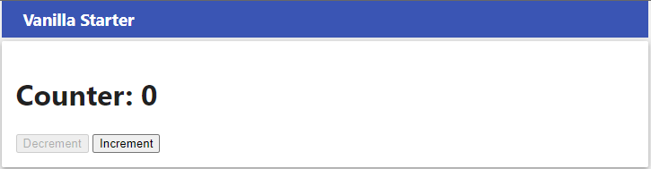
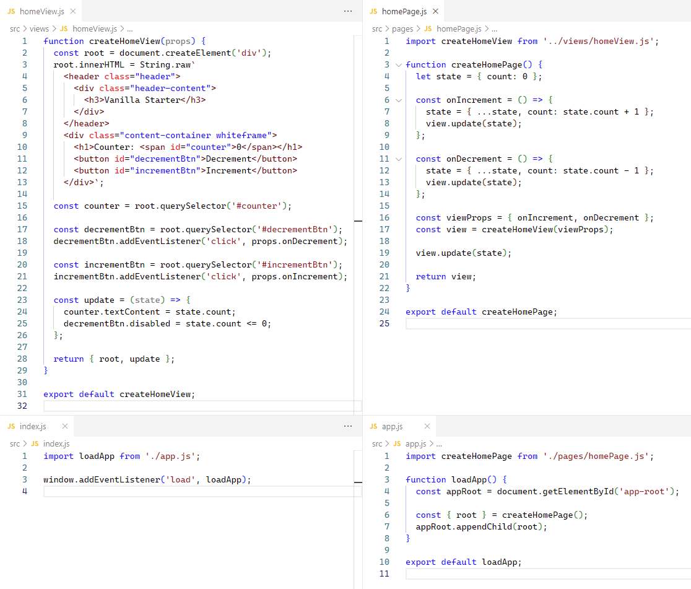

# Starter Application Architecture

## 1. Introduction

In the sections that follow we will outline architectural patterns and techniques that will help you to build a robust, maintainable Single Page Application with vanilla JavaScript, using concepts inspired by libraries/frameworks such as React and Angular.

> **Application Architecture Definition**
>
> _An application architecture describes the patterns and techniques used to design and build an application. The architecture gives you a roadmap and best practices to follow when building an application, so that you end up with a well-structured app._
>
> _Software design patterns can help you to build an application. A pattern describes a repeatable solution to a problem._
>
> Source: RedHat, [What is an application architecture?](https://www.redhat.com/en/topics/cloud-native-apps/what-is-an-application-architecture)

An application architecture also serves as a common vocabulary to communicate with other developers and teams. Those developers and teams will expect to find these rules and patterns being applied in in your application. To meet these expectations it is important for you to follow them as closely as possible.

For architecture at hand, we will outline patterns for standard Page and View functions, how to manage application state and standard techniques for handling events and for fetching data.

## 2. The Page/View/State Model

Figure 1 below gives a high-level overview of the core application architecture used throughout this starter repo. We will refer to it as the **Page/View/State Model**. It is simplest form, an application following this architecture is made up of a Page object, a View objects, and a state object. All three object are regular JavaScript objects.

<br>
Figure 1: **The Page / View / State Model**

### 2.1 Code Example

Perhaps the quickest way to understand the Page/View/State Model is to look at a code example for a mini application that uses this model. In this mini application, the **Increment** button increments the counter by 1 and the **Decrement** button decrements it by 1. The application prevents the counter to go below 0 by disabling the **Decrement** button when the counter is 0.

<br>
Figure 2: **Mini Application UI**

Figure 3 below gives an overview of the complete JavaScript code for this mini application. We will look in detail at the `homePage.js` and `homeView.js` files later in the next section. The other two files should speak for themselves.

<br>
Figure 3: **Mini Application JavaScript Files**

### 2.1.1 homeView.js

Code: [homeView.js](../src/views/homeView.js)

It is perhaps best to start our discussion with the View object of our Page/View/State model. In our mini application example this object is created in the `homeView.js` file. This file exports a single function named `createHomeView()` which takes a single argument `props` (short for _properties_) and returns a View object: `{ root, update }`.

The names `homeView.js` and `createHomeView` are chosen to conform to a naming standards prescribed by the Application Architecture used throughout this starter repo. The generic forms for a View are **xxxView.js** for the filename and **createXXXView** for the function, where **XXX** is the name of the Page/View.

The **createXXXView()** function, which we will simply refer to as "View function" from this point forward, does the following:

1. It creates a subtree of DOM elements which will be used to render the page.
2. It attaches event handler functions passed to it through the `props` argument to the relevant DOM element.
3. It defines an internal `update()` function which can be called by the Page object to update the DOM elements of the view.
4. It returns an object that holds references to both the root element of DOM subtree and to the internal `update()` function. This object is called a View object.

Note that the View function creates a closure: the internal `update()` function has access to all the variables in the scope of the View function.

### 2.1.1 homePage.js

Code: [homePage.js](../src/pages/homePage.js)

This file exports a function that returns a Page object, which represents an application page. A Page function should again, by convention, conform to the naming standard **createXXXPage** for the function name and **xxxPage.js** for its filename.

In the simplest scenario (as is the case here), a Page object is identical to a View object. That's why the `createHomePage()` function in our example simply return the View object returned by `createHomeView()`.

Let's walk through the code a little bit more closely.

<!-- prettier-ignore -->
| Line(s) | Description |
| :-----: | ----------- |
| 1 | The Page function is the one and only importer of the View function. It can be regarded as its owner. |
| 4 | The `state` object represents the State part of our Page/View/State model. In this example, our entire application state consists of just simple counter, which is initialized to 0. |
| 6-13 | The `onIncrement()` and `onDecrement()` functions are event handler functions that will be passed to the View through its `props` argument (here called `viewProps`. The update the state object and call the View's `update()` method to let the View update its DOM subtree. |
| 7, 12 | A special note with respect to how the state is updated. This is done by creating a new `state` object rather than mutating the existing one (e.g. by using `state.counter++`). While this may seem overly complex here, it becomes essential when using libraries such as React. That's why it is useful to get used to this practice from the start. |
| 16-17 | The event handler functions are passed to the View function through the `viewProps` argument. |
| 19 | After the View is created, the View's `update()` method is called. Since the counter starts at 0 we want to View to disable its **Decrement** button. This call to `update()` achieves that. |
| 21 | We return a Page object which in this case is identical to the View object returned by the View function. |


The `createHomePage()` function first creates a `state` object (line 4), which forms the State part of our Page/View/State model. In this example, our entire application state is formed by just simple counter, which is initialized to 0.

The function signature for a Page function is as follows:

```js
function createXXXPage(): {
  root: HTMLElement,
  update?: () => void,
}
```

A Page object is responsible for handling user interactions for that page and for managing the fetching of data from Web APIs, when required. In an application that consist of a single page only there will be just one Page function.

A Page function is not responsible for creating and updating the DOM elements for a page. This is the responsibility of its companion View object.

A Page function is responsible for handling all user interactions for the page and for initiating and handling the fetching of data from Web APIs where required.The creation and updating of DOM elements is normally delegated to a companion View function, which is then called by the Page function.

The name of a Page function is prescribed by this architecture as should follow the naming convention **create**_XXX_**Page**, where _XXX_ is the name of the Page. Example: `createAboutPage`. Each Page function should be in a separate file, named `xxxPage.js`, e.g., `aboutPage.js`.

<!-- prettier-ignore -->
| Parameter | Description |
|-----------|-------------|
| `props` | When using a router, any parameters encoded in the browser's location url will be passed to the Page function inside a object: `{ params: [param, ...] }`. |

A Page function should return a JavaScript object with, with the following properties:

<!-- prettier-ignore -->
| Property | Required? | Description |
|----------|:---------:|-------------|
| `root` | Yes | Holds a reference to the `root` element of the DOM subtree owned by the Page function (normally created by a subordinate View function that is called by the Page function). |
| `update` | No | A callback method implemented by the View. Called internally in the Page object to update the DOM subtree with state changes.|

The standard pattern for a Page function is similar to:

```js
import createFooView from '../views/fooView.js';

function createFooPage() {
  const viewProps = {
    // Add properties to be passed to the View function
  };
  const view = createFooView(viewProps);

  // Place any code needed to initialize the page, e.g. to fetch data, here.
  // ...

  // Return the object containing the View's root DOM element to the caller of / the Page function.
  return view;
}

export default createFooPage;
```

A Page function can pass event handlers to the View function through the `viewProps` object. The View function can then add these event handlers to the target DOM elements by calling `.addEventListener()` on those elements.

```js
import createFooView from '../views/fooView.js';

function createFooPage() {
  const viewProps = { onClick: () => {...} };
  const view = createFooView(viewProps);
  return view;
}
```

## 3. View Functions: `createXXXView()`

The name of a View function should follow the naming convention **create**_XXX_**View**, where _XXX_ is the name of the View. Example: `createAboutView`. Each View function should be in a separate file, named `xxxView.js`, e.g., `aboutView.js`.

The function signature for a View function is as follows:

```js
createXXXView(props?: object) => { root: HTMLElement, update?: Function }
```

<!-- prettier-ignore -->
| Parameter | Description |
|-----------|-------------|
| `props`   | On object with properties that hold values and/or event handler functions to be used when creating the View's DOM subtree. |

View functions are used to create and update DOM elements in the service of corresponding Page functions or other View functions. A View function can render application data and add any event handlers passed to it through the `props` parameter. It must return an object with the following properties:

<!-- prettier-ignore -->
| Property | Required? | Description |
|----------|:---------:|-------------|
| `root` | Yes | Holds a reference to the `root` element of the DOM subtree created by the View function. |
| `update` | No | If provided, it should be a function that updates the DOM subtree with the latest application state information. |

A View function typically first creates a DOM element that represents the `root` element of the View's DOM subtree. It can then add child elements to that root through its `.innerHTML` property or through calls to `.appendChild()`.

> Warning: You should normally not use `.innerHTML` for production applications. There are potential security issues associated with its use. However, since you are expected to later switch to established libraries, such as React (which uses HTML-like syntax called JSX), we have in this starter repo opted to take advantage of the simplicity and convenience that `.innerHTML` provides for defining HTML structures.
>
> For more info on the security issues associated with `.innerHTML`, see [Security considerations](https://developer.mozilla.org/en-US/docs/Web/API/Element/innerHTML#security_considerations) on the MDN web site.

Here is an example of a simple View function.

```js
function createFooView(props) {
  const root = document.createElement('div');
  root.className = 'dialog-container';
  root.innerHTML = String.raw`
    <h1>${props.text}</h1>
  `;

  return { root };
}

export default createFooView;
```

> _Tip: There is a handy VSCode extension that adds syntax coloring to JavaScript string templates if they contain HTML code. It also adds [emmet](https://emmet.io/) support. Install this extension and then mark your HTML string templates with `String.raw` to enable the magic.<br>
> Find it here: [Visual Studio Marketplace: lit-html](https://marketplace.visualstudio.com/items?itemName=bierner.lit-html)_

Inside the View function you can access child elements the `root` element by calling `.querySelector()` on it, or by using the provided utility function `findElementsWithIds()` from the `lib` folder.

A View function may call other View functions and incorporate their root elements as child elements of its own DOM subtree.

> _What you should **not** do is access DOM element (e.g. by using `document.getElementById()` or `document.querySelector()`) outside of the View function where the DOM elements are created. This would be a violation of the architectural principles outlined here and because of it breaking the rules, introduce a potential maintenance issue. If you find yourself needing to violate this rule you probably need to rethink the way you have organized your pages and views._

### 3.1 The `update()` callback

A View function can return an optional `update()` callback function that can be called to update the view after changes have been made to the application state. The application state is held in a JavaScript object that is passed as argument to the `update()` callback.

Here is a simple example:

```js
function createSearchView(props) {
  const root = document.createElement('div');
  root.innerHTML = String.raw`
    <input type="text" id="searchInput" placeholder="Search" />
  `;

  const input = root.querySelector('#searchInput');
  input.addEventListener('input', () => props.onInput);

  const update = (state) => {
    input.value = state.searchText || '';
  };

  return { root, update };
}
```

In this example the `update()` function is used to update the value of the `<input>` element with the value of the `searchText` property of the application state.

Here, the `input` element is completely controlled through code (in React this is called a _controlled component_). For instance, the `onInput()` event handler could ignore any leading and/or trailing spaces and convert any uppercase letters to lowercase. Then, the `input` element's value attribute is updated accordingly.

## 4. Page/View Interactions

Figure 1 below represents a [UML Sequence Diagram](https://en.wikipedia.org/wiki/Sequence_diagram), illustrating the interactions between the Page and View objects. In this example the application consists of a single client-side page. (Multi-page applications require the use of a client-side router and will be discussed as an advanced topic in a separate README.)

> From [Wikipedia](https://en.wikipedia.org/wiki/Sequence_diagram): _"A sequence diagram or system sequence diagram (SSD) shows object interactions arranged in time sequence in the field of software engineering. It depicts the objects involved in the scenario and the sequence of messages exchanged between the objects needed to carry out the functionality of scenario."_
>
> Note: The _"messages"_ referred to in this quotation are in our case function calls and returns.

The top three boxes in Figure 1 represent the three interacting files / ES6 modules / objects in this example.

<!-- prettier-ignore -->
| ES6 Module | Description |
|------------|-------------|
| `app.js` | Contains the application's startup code. |
| `fooPage.js` | Owns and manages the application page (named `foo` here) and handles all its user interactions. |
| `fooView.js` | Create the DOM subtree for the page and, if needed, updates its DOM elements as needed when the application state changes. |

The vertical dotted lines extending downwards from the boxes represent times lines, with rectangular (_"activation"_) blocks indicating where code from a module is actively executing.

The horizontal arrows depict function calls and returns between the interacting modules (called _"messages"_ in UML nomenclature).

<br>
Figure 1: **Page/View Interactions**

Let's now go through the various numbered steps in the diagram.

1. `app.js` contains the start-up code. It performs some initialization tasks and then calls the `createFooPage()` function imported from `fooPage.js` to create the one and only page in the application.

2. The `createFooPage()` function first sets up any view props (a JavaScript object) as needed for the View, such as event handlers for the View's DOM elements. In the diagram two event handler are shown: `onClick()` which will handle a `"click"` event and `onInput()` which will handle an `"input"` event.

   The `createFooPage()` next calls the `createFooView()` function imported from `fooView.js` to create the View, passing the event handlers as view props as illustrated in this code snippet.

   ```js
   const onClick = () => { ... };
   const onInput = () => { ... };
   const viewProps = { onClick, onInput };
   const view = createFooView(viewProps);
   ```

3. The `createFooView()` function creates the View's DOM subtree, attaches any event listener and, if needed, sets up an `update()` callback function that can be called to update the View DOM subtree whenever the application state changes.

   ```js
   function createFooView(props) {
     const root = ...

     myButton.addEventListener('click', props.onClick);
     myInput.addEventListener('input', props.onInput);

     const update = (state) => {
       ...
     };

     return { root, update }
   }
   ```

4. The `createFooView()` function returns an object with the following properties:

   <!-- prettier-ignore -->
   | Property | Description |
   |----------|-------------|
   | `root` | The `root` element of the DOM subtree created by the View function.|
   | `update` | The callback function as described above. |

5. The `createFooPage()` function, in its turn, passes back the same View object(, optionally extended with two more properties used by the router, see [ROUTER.md](ROUTER.md)).

6. In `app.js`, the returned `root` element from the View's DOM subtree is inserted into the document's DOM.

7. DOM event emitted by elements from the View's DOM subtree are handled by event handlers that reside in the Page module. This separation of responsibilities is a key principle of the application architecture described here. The event handlers were passed through the `props` argument to the View function which added them as event listeners to the appropriate DOM elements. Here, a `"click"` event is handled by the `onClick()` event handler. (Similarly, an `"input"` event is handled by the `onInput()` event handler.)

8. The `onClick()` event handler inside the Page object will likely change the application state, either directly (synchronously) or perhaps by making Web API network request.

9. When the Page object updates the application state object with new or updated data it calls the `update()` function passing the updated state object an argument.

10. The View's `update()` function can then use the new application state to update, as needed, its DOM subtree.

### 5. Managing State

...

### 6. Division of Responsibilities between the Page and View

The Page function is responsible for handling all user interactions with the page and for updating the application state with any changes resulting from these interactions. If provided, it should call the `update()` method of its subordinate View, passing the updated state object as argument.

The View function is responsible for creating the page's DOM subtree and, where needed, responding to state changes passed to it through its `update()` method.

DOM event handlers should reside in the Page function and be passed as props to the View function.

Network requests should be made by the Page function, either when the page is initially created and/or as a response to user interactions triggering a DOM events.

All communication from the Page to View should be done by the Page function calling the `update()` function of the View, passings an updated state object as an argument.

All communication from the View to Page should be done by means of event handlers that are passed as props to the View function.

These principles form the core of the application architecture described here.

Here is a list of examples of things that this architecture forbids:

- Access DOM elements outside of the View function itself, e.g. by using `document.getElementById()` or `document.querySelector()`.
- Handling events inside a View function itself.
- Mutating or updating the state object inside a View function. Inside a View function it should be considered readonly.
- Exporting anything other the `createXXXPage()` function from a Page module.
- Exporting anything other than the `createXXXView()` function from a View module.
- Adding more parameters than those documented here to the `createXXXPage()`, `createXXXView()` or `update()` functions.

All the example applications in this repo strictly follow these principles.

### 6. Fetching Data in a Page Function

Here is an example (simplified) of the recommended practice for fetching data from a Web API inside a Page function.

```js
function createFooPage() {
  let state = {};

  const getData = async () => {
    state = { ...state, loading: true, error: null, data: null };
    view.update(state);

    try {
      const data = await fetchData(`${BASE_URL}?q=foo`);
      state = { ...state, data: data, loading: false };
      view.update(state);
    } catch (error) {
      state = { ...state, error: error, loading: false };
      view.update(state);
    }
  };

  const onGetClick = () => getData();

  const viewProps = { onGetClick };
  const view = createFooView(viewProps);

  return view;
}
```

Figure 2 below illustrates the recommended interactions between the Page and View objects when fetching data from a Web API.

<br>
Figure 2: **Fetching data in a Page function**

These are the steps involved:

1. The user click on a button to to retrieve data from a Web API. The `"click"` event is handled by the `onClick` event handler inside the Page function.

2. The event handler updates the state object: it set the `loading` property to `true`, the `error` property to `null` (e.g. no error yet), and the `data` property to `null` (e.g. no data yet). The Page object will then call the `update()` method of the View object with the updated state object as an argument.

3. Inside `update()` method of the View, the `loading` property is checked. If it is `true`, the View will show a loading indicator. Otherwise, it will hide it.

4. The Page object will now make a network request to try and fetch data from the Web API.

5. Some time later, the network request completes, hopefully with a successful response.

6. The Page object will then update the state object with the new data and the `loading` property set to `false`. It will call the `update()` method of the View object again with the updated state object as an argument.

7. The View will then update its DOM subtree with the new data: it will hide the loading indicator (`loading: false`) and show the data.

For a fully worked-out example inspect the [Pokemons example](src/examples/pokemons/pages/pokemonsPage.js) in this repository.

#### 3.4.1 Techniques for updating the state object

In this example, before calling `fetchData()` we update the local state object using ES7 [spread syntax](https://developer.mozilla.org/en-US/docs/Web/JavaScript/Reference/Operators/Spread_syntax).

```js
state = { ...state, loading: true, error: null };
```

This statement assigns a new object to `state` variable by first spreading out its current properties and then adding the `loading` and `error` properties or overwriting them if they already existed in the `state` object: properties that are listed later in the object literal overwrite earlier ones.

```js
state = { ...state, error, loading: false };
```

Here, ES6 object shorthand notation is used for the `error` property. It is equivalent to `error: error`.

As you can see, the state object is not mutated directly. Instead, a new object is created and assigned to the `state` variable. This is a good practice which you will encounter again when you work with React.

#### 3.4.2 Handling state updates in the View

In the corresponding View function (simplified) the `update()` callback function typically handles the loading and render phases as follows:

```js
//...

const update = (state) => {
  // Show the loading indicator when the data is being fetched
  if (state.loading) {
    spinnerView.root.classList.remove('hide');
    return;
  }

  // Hide the loading indicator in any other case
  spinnerView.root.classList.add('hide');

  // In case of an error, render it and return early.
  if (state.error) {
    container.classList.remove('hide');
    container.textContent = state.error.message;
    return;
  }

  // If there is no error and we have data, we can render it.
  if (state.data) {
    // Code omitted for brevity
  }
};
```

Full implementation: [src/examples/pokemons/views/pokemonsView.js](src/examples/pokemons/views/pokemonsView.js)

---

<!-- prettier-ignore -->
| Object | Description |
| --- | --- |
| Page | The Page object represents an application page and is the top-level UI object of the application. In a single-page<sup>1</sup> application it is created during application startup, i.e. in `app.js`. It is responsible for creating and updating its subordinate View object, handling DOM events passed up from its View, and for communicating with external APIs. |
| View | The View object is the UI object that is responsible for creating and updating the DOM elements that represent the UI for the page. |
| state | The state object is a data object that holds the current state of the application. It is updated by the Page in response to user interactions and sent to the View after the each update. The View can then inspect the state object and use its information to update its DOM elements. |

Notes:

1. The term "Single Page Application" (SPA) normally refers to a web application that loads a single HTML file, which, once loaded, is manipulated by means of JavaScript throughout the application's lifetime. An SPA can still appear to have multiple _client-side_ pages, but those pages are the result of JavaScript manipulation rather than being loaded as separate HTML files from a server. The creation of a multi-page SPA requires the use of client-side router, which is discussed in a [separate document](ROUTER.md) as an advanced topic. In the current document we will assume an SPA with a single client-side page.
