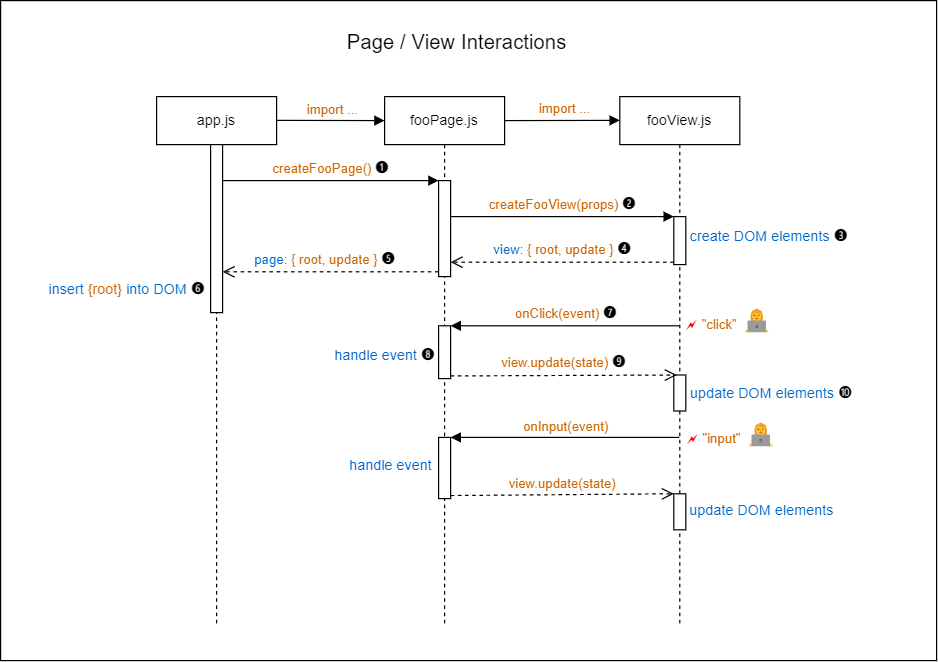

# Page and View Functions

## 1. Page Functions

A Page function takes an optional `props` argument and returns a Page object.

The function signature for a Page function is as follows:

```js
function createXXXPage(props?: object): {
  root: HTMLElement,
  update?: () => void,
  pageDidLoad?: () => void,
  pageWillUnload?: () => void,
}
```

<!-- prettier-ignore -->
| Parameter | Description |
|-----------|-------------|
| `props` | When using a router, any parameters encoded in the browser's location url will be passed to the Page function inside a object: `{ params: [param, ...] }`. |

A Page object is responsible for handling user interactions for that page and for managing the fetching of data from Web APIs, where required. In an application that consist of a single client-side page only there will be just one Page function.

A Page function is not responsible for creating and/or updating the DOM elements of a page. This is the responsibility of a subordinate View function.

The name of a Page function is prescribed by this architecture to follow the naming convention **createXXXPage**, where XXX is the name of the Page. For example: `createAboutPage`. Each Page function should be in a separate file, named `xxxPage.js`, e.g., `aboutPage.js`.

A Page function should return a JavaScript object with, with the following properties:

<!-- prettier-ignore -->
| Property | Required? | Description |
|----------|:---------:|-------------|
| `root` | Yes | Holds a reference to the `root` element of the DOM subtree owned by the Page function (created by a subordinate View function that is called by the Page function). |
| `update` | No | A callback method, implemented by the View. Called internally in the Page object to update the DOM subtree with state changes.|
| `pageDidLoad`<sup>1</sup> | No | A lifecycle callback method. If provided, called by the router just after loading the page. |
| `pageWillUnloadLoad`<sup>1</sup> | No | A lifecycle callback method. If provided, called by the router just prior to unloading the page (i.e. when the router is about to load another page). |

Notes:

1. See Router: [2.4 Lifecycle Methods](./ROUTER.md#24-lifecycle-methods) for more information.

The standard pattern for a Page function is similar to:

```js
import createFooView from '../views/fooView.js';

function createFooPage(props) {
  const viewProps = {
    // Add properties to be passed to the View function
  };
  const view = createFooView(viewProps);

  // Place any code needed to initialize the page, e.g. to fetch data, here.
  // ...

  // Return the object containing the View's root DOM element to the caller of / the Page function.
  return view;
}

export default createFooPage;
```

A Page function can pass event handlers to the View function through the `viewProps` object. The View function can then add these event handlers to the target DOM elements by calling `.addEventListener()` on those elements.

```js
import createFooView from '../views/fooView.js';

function createFooPage() {
  const viewProps = { onClick: () => {...} };
  const view = createFooView(viewProps);
  return view;
}
```

## 2. View Functions

The name of a View function should follow the naming convention **createXXXView**, where XXX is the name of the View. Example: `createAboutView`. Each View function should be in a separate file, named `xxxView.js`, e.g., `aboutView.js`.

The function signature for a View function is as follows:

```js
function createXXXView(props?: object): {
  root: HTMLElement,
  update?: () => void,
}
```

<!-- prettier-ignore -->
| Parameter | Description |
|-----------|-------------|
| `props`   | On object with properties that hold values and/or event handler functions to be used when creating the View's DOM subtree. |

View functions are used to create and update DOM elements in the service of corresponding Page functions or other View functions. A View function can render application data and add any event handlers passed to it through the `props` parameter. It must return an object with the following properties:

<!-- prettier-ignore -->
| Property | Required? | Description |
|----------|:---------:|-------------|
| `root` | Yes | Holds a reference to the `root` element of the DOM subtree created by the View function. |
| `update` | No | If provided, it should be a function that updates the DOM subtree with the latest application state information. |

A View function typically first creates a DOM element that represents the `root` element of the View's DOM subtree. It can then add child elements to that root through its `.innerHTML` property or through calls to `.appendChild()`.

> Warning: You should normally not use `.innerHTML` for production applications. There are potential security issues associated with its use. However, since you are expected to later switch to established libraries, such as React (which uses HTML-like syntax called JSX), we have in this starter repo opted to take advantage of the simplicity and convenience that `.innerHTML` provides for defining HTML structures.
>
> For more info on the security issues associated with `.innerHTML`, see [Security considerations](https://developer.mozilla.org/en-US/docs/Web/API/Element/innerHTML#security_considerations) on the MDN web site.

Here is an example of a simple View function.

```js
function createFooView(props) {
  const root = document.createElement('div');
  root.className = 'dialog-container';
  root.innerHTML = String.raw`
    <h1>${props.text}</h1>
  `;

  return { root };
}

export default createFooView;
```

> _Tip: There is a handy VSCode extension that adds syntax coloring to JavaScript string templates if they contain HTML code. It also adds [emmet](https://emmet.io/) support. Install this extension and then mark your HTML string templates with `String.raw` to enable the magic.<br>
> Find it here: [Visual Studio Marketplace: lit-html](https://marketplace.visualstudio.com/items?itemName=bierner.lit-html)_

Inside the View function you can access child elements the `root` element by calling `.querySelector()` on it, or by using the provided utility function `findElementsWithIds()` from the `lib` folder.

A View function may call other View functions and incorporate their root elements as child elements of its own DOM subtree.

### 2.1 The `update()` callback

A View function can return an optional `update()` callback function that can be called to update the view after changes have been made to the application state. The application state is held in a JavaScript object that is passed as argument to the `update()` callback.

Here is a simple example:

```js
function createSearchView(props) {
  const root = document.createElement('div');
  root.innerHTML = String.raw`
    <input type="text" id="searchInput" placeholder="Search" />
  `;

  const input = root.querySelector('#searchInput');
  input.addEventListener('input', () => props.onInput);

  const update = (state) => {
    input.value = state.searchText || '';
  };

  return { root, update };
}
```

In this example the `update()` function is used to update the value of the `<input>` element with the value of the `searchText` property of the application state.

Here, the `input` element is completely controlled through code (in React this is called a _controlled component_). For instance, the `onInput()` event handler could ignore any leading and/or trailing spaces and convert any uppercase letters to lowercase. Then, the `input` element's value attribute is updated accordingly.

## 3. Page/View Interactions

Figure 1 shows a [UML Sequence Diagram](https://en.wikipedia.org/wiki/Sequence_diagram) that illustrates the interactions between the Page and View objects. In this example application there is only one client-side page.

> From [Wikipedia](https://en.wikipedia.org/wiki/Sequence_diagram): _"A sequence diagram or system sequence diagram (SSD) shows object interactions arranged in time sequence in the field of software engineering. It depicts the objects involved in the scenario and the sequence of messages exchanged between the objects needed to carry out the functionality of scenario."_
>
> The "messages" mentioned in this quotation are in our case function calls and function returns.

The top three boxes represent the three interacting files / ES6 modules in this scenario.

<!-- prettier-ignore -->
| ES6 Module | Description |
|------|-------------|
| `app.js` | Contains the application's startup code. |
| `fooPage.js` | Creates the application page and handles user interactions. |
| `fooView.js` | Creates the DOM subtree for the page and, if needed, updates its DOM elements with application state changes. |

The vertical dotted lines extending downwards from the boxes represent timelines, with rectangular blocks indicating where code from a module is actively executing.

The horizontal arrows depict the interactions ("messages") between the modules, i.e. function calls and function returns.

<br>
Figure 1: **Page/View interactions**

Let's now go through the various numbered steps in the diagram.

1. `app.js` contains the start-up code. It performs some initialization tasks and then calls the `createFooPage()` function imported from `fooPage.js` to create the one and only page in the application.

2. The `createFooPage()` function first sets up any view props (a JavaScript object) as needed for the View, such as event handlers for the View's DOM elements. In the diagram two event handlers are shown: `onClick()` which will handle a `"click"` event and `onInput()` which will handle an `"input"` event.

   The `createFooPage()` function next calls the `createFooView()` function imported from `fooView.js` to create the View, passing the event handlers as view props:

   ```js
   const onClick = () => { ... };
   const onInput = () => { ... };
   const viewProps = { onClick, onInput };
   const view = createFooView(viewProps);
   ```

3. The `createFooView()` function creates the View's DOM subtree, attaches any event listener and, if needed, sets up an `update()` callback function that can be called to update the View DOM subtree whenever the application state changes.

   ```js
   function createFooView(props) {
     const root = ...
     ...
     myButton.addEventListener('click', props.onClick);
     myInput.addEventListener('input', props.onInput);

     const update = (state) => {
       ...
     };

     return { root, update }
   }
   ```

4. The `createFooView()` function returns an object with the following properties:

   <!-- prettier-ignore -->
   | Property | Description |
   |----------|-------------|
   | `root` | The `root` element of the DOM subtree created by the View function. |
   | `update` | The update callback function as described above. |

5. The `createFooPage()` function, in its turn, returns the View object it received from its call to `createFooView()`.

6. In `app.js`, the returned `root` element from the View's DOM subtree is inserted into the DOM.

7. DOM events emitted by elements from the View's DOM subtree are handled by event handlers that reside in the Page module. These event handlers were passed as view props to the View function which added them as event listeners to the appropriate DOM elements. Here, a `"click"` event is handled by the `onClick()` event handler. (Similarly, an `"input"` event is handled by the `onInput()` event handler.)

8. The `onClick()` event handler will likely cause application state changes, either directly (synchronously) or asynchronously, perhaps as the result of a network request.

9. When the application state changes, the `update()` callback function from the View should be called to communicate these state changes back to the View.

10. The View's `update()` function can then use the new application state to update, as needed, any DOM elements it has created.
