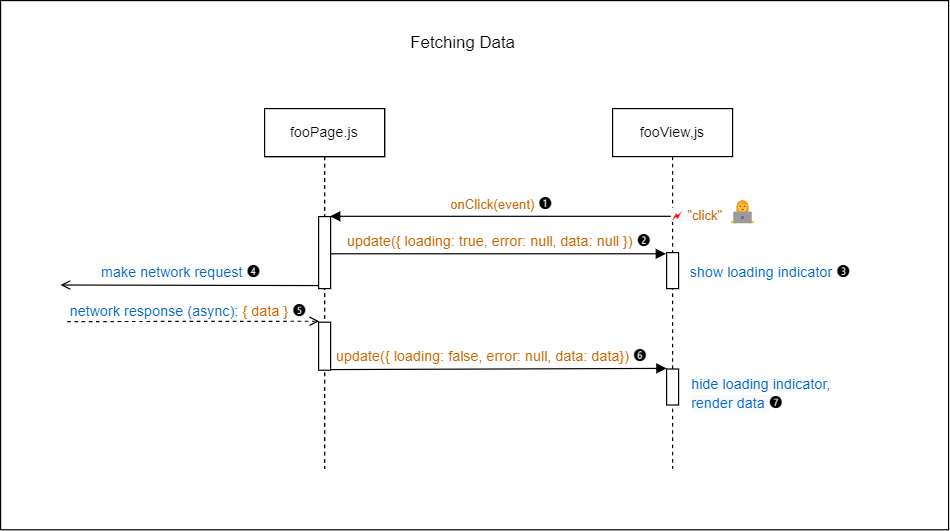

# Recipes

## 1. General

### 1.1 Function declarations

In the example applications of this repository all functions at the file/module level have been defined using regular function declarations, while arrow function syntax has been used for internal functions. Whether you do the same or not is up to you. However, whatever approach you take, it is important that you do this consistently throughout your code.

## 2. Page Functions

### 2.1 Updating the state object and calling update()

In the [`homePage.js`](../src/pages/homePage.js) starter code (see [Original code](#211-original-code) below) we are updating the state object and calling the `view.update()` method in several places in our code to let the View update it's DOM subtree.

#### 2.1.1 Original code

```js
function createHomePage() {
  let state = { count: 0 };

  const onIncrement = () => {
    state = { ...state, count: state.count + 1 };
    view.update(state);
  };

  const onDecrement = () => {
    state = { ...state, count: state.count - 1 };
    view.update(state);
  };

  const viewProps = { onIncrement, onDecrement };
  const view = createHomeView(viewProps);

  view.update(state);

  return view;
}
```

To eliminate this duplication we can introduce a small helper function (see [Improved code](#212-improved-code)). This `updateState()` helper function takes as an argument an object that contains only the updates that we want to apply to the state. With this function being the single place where these states updates are made, we can now also slip in a `console.log` to print the state object to the console each time it is updated. Because the state object plays such a central role in the app, logging it each time it is updated makes it easier for us during development to see what is going on.

#### 2.1.2 Improved code

```js
function createHomePage() {
  let state = { count: 0 };

  const updateState = (updates) => {
    state = { ...state, ...updates };
    console.log('state', state);
    view.update(state);
  };

  const onIncrement = () => {
    updateState({ count: state.count + 1 });
  };

  const onDecrement = () => {
    updateState({ count: state.count - 1 });
  };

  const viewProps = { onIncrement, onDecrement };
  const view = createHomeView(viewProps);

  view.update(state);

  return view;
}
```

### 2.2 Accessing the value property of an \<input> element inside a Page function

A Page function does not (and should not) have direct access to the DOM elements of its View. This _Separation of Concerns_ design principle is core to the current Application Architecture. Given this restriction, how do we access the value of an \<input> element?

The answer is to let the Page function pass an event handler to the View for the `"input"` event. The event handler can then update the state from `event.target.value`. Whenever we need the value of the input field inside the Page function, we can now access it indirectly through the state object. (See [Controlled Component](#221-controlled-component) below.)

At the same time, the value of the input element can also be updated inside the View from the state object, through the View's `update()` method. This allows the event handler in the Page function to control the value of the input element.

In the example below the `onFilterInput()` event handler trims the string value obtained from the event object and converts it to lowercase before updating the state. The net effect of this is that the value of the input element will always be in lowercase, without leading or trailing whitespace. In React, this would be called a "controlled component".

Note that the same technique can also be applied for similar input elements, such as the \<select> element.

#### 2.2.1 Controlled Component

Full code: [reposPage.js](../src/examples/github/pages/reposPage.js)

```js
function createReposPage(props) {
  // ...

  const onFilterInput = (e) => {
    const filter = e.target.value.trim().toLowerCase();
    state$.update({ filter });
  };

  const onClearFilter = () => {
    state$.update({ filter: '' });
  };

  // ...

  const viewProps = {
    // ...
    onFilterInput,
    onClearFilter,
  };

  const reposView = createReposView(viewProps);

  // ...
}
```

Full code: [toolbarView.js](../src/examples/github/views/toolbarView.js)

```js
function createToolbarView(props) {
  const root = document.createElement('div');
  // simplified
  root.innerHTML = String.raw`
    <div>
      <input type="text" id="filterInput"/>
      <button type="button" id="btnClear" disabled>Clear</button>
    </div>
  `;

  const { filterInput, btnClear } = findElementsWithIds(root);

  filterInput.addEventListener('input', props.onFilterInput);
  btnClear.addEventListener('click', props.onClearFilter);

  const update = (state) => {
    filterInput.value = state.filter || '';
    btnClear.disabled = !state.filter;
  };

  return { root, update };
}
```

### 2.3 Fetching data and showing a loading indicator

Here is an example (simplified) of the recommended practice for fetching data from a Web API inside a Page function.

```js
function createFooPage() {
  let state = {};

  const getData = async () => {
    state = { ...state, loading: true, error: null, data: null };
    view.update(state);

    try {
      const data = await fetchData(`${BASE_URL}?q=foo`);
      state = { ...state, data: data, loading: false };
      view.update(state);
    } catch (error) {
      state = { ...state, error: error, loading: false };
      view.update(state);
    }
  };

  const onGetClick = () => getData();

  const viewProps = { onGetClick };
  const view = createFooView(viewProps);

  return view;
}
```

The sequence diagram below (Figure 1) illustrates the necessary interactions between the Page and View objects when fetching data from a Web API.

<br>
Figure 1: **Fetching data in a Page function**

These are the steps involved:

1. The user clicks on a button to retrieve data from a Web API. The `"click"` event is handled by the `onClick` event handler inside the Page function.

2. The event handler updates the state object: it sets the `loading` property to `true`, the `error` property to `null` (i.e., no error yet), and the `data` property to `null` (i.e., no data yet). The event handler will then call the `update()` method of the View object with the updated state object as an argument.

3. Inside the `update()` method of the View, the `loading` property of the state object is checked. If it is `true`, the View will show a loading indicator. If `false`, it will hide it.

4. The event handler will now make an asynchronous network request to try and fetch data from the Web API.

5. Some time later the network request completes, hopefully with a successful response.

6. Next, the state object will be updated with the fetched data and the `loading` property set to `false`. Then, the `update()` method of the View object will be called again with the updated state object as an argument.

7. Finally, the View will update its DOM subtree with the new data: it will hide the loading indicator (`loading: false`) and render the data.

For a fully worked-out example inspect the [Pokemons example](../src/examples/pokemons/pages/pokemonsPage.js) in this repository.

## 3. View functions

### 3.1 Detecting state changes in `view.update()`

Sometimes you want to (re)render parts of a View only if there is a relevant change in the state object. In the Currency Converter example, the \<select> elements should be populated with symbols for the available currencies only once. This can only be done inside the `update()` method of the View, since these symbols need to be fetched first and are therefore not available when the View is initially created. But once the symbols are fetched and the \<select> are populated you don't want to do it again on subsequent calls to `update()`. One technique that allows you to prevent this is to check the current state against the previous state and only (re)render if there is a change in the relevant state property. For the Currency Converter example, this relevant property is the `state.symbols` property.

First, we must pass the previous state as a second argument to the `update()` method. In [converterPage.js](../src/examples/currency-converter/pages/converterPage.js) this is done as follows:

```js
function createConverterPage() {
  // Initialize local state object.
  let state = { amount: 1 };

  // Internal helper function to update the state and call the `update()` method
  // of the view.
  const updateState = (updates) => {
    const prevState = { ...state };
    state = { ...state, ...updates };
    console.log('state', state);
    view.update(state, prevState); // pass previous state as second argument
  };

  //...
}
```

Inside the `update()` method of the View ([converterView.js](../src/examples/currency-converter/views/converterView.js)), we check the current and previous values of the `symbols` property and only populate the \<select> elements if they are different.

```js
if (state.symbols && state.symbols !== prevState.symbols) {
  // populate the <select> elements
}
```
