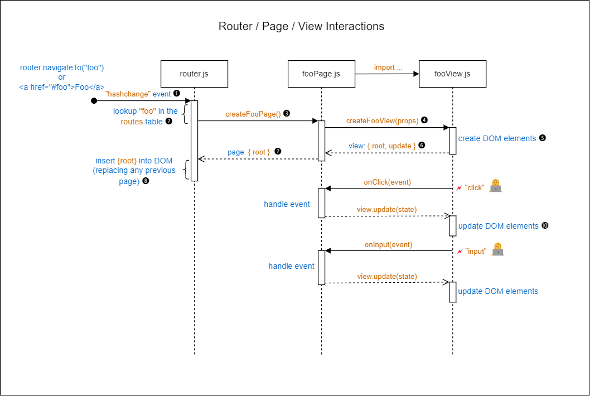
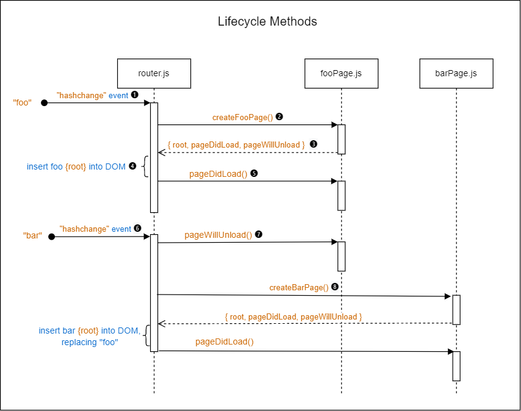

# Router

Implementation: [src/lib/router.js](../src/lib/router.js)

## 1. Introduction

This document describes a client-side router that can be used to navigate between pages in an SPA with multiple client-side pages.

The purpose of a client-side router is to let the client programmatically load different application 'pages' into the DOM by manipulating the browser's location URL. In a hash-based router, as provided in this repo, the specific page to load is determined by the `hash` fragment of the `url`. In a `url`, a hash fragment is the part that starts with a `#` symbol. Everything following the `#` symbol is considered part of the hash.

We can use the hash to specify the name of the page to load and can optionally embed parameters to pass to the Page function. In a sense, the `url` when used in such a way becomes part of the application state.

A hash-based router uses an event listener to listen for hash changes and responds to those changes by loading a matching page.

Here is an example of how we can use a hash to specify a page name and two parameters.

```console
#repo/HackYourFuture/UsingAPIs
```

The complete url could look like this (click it!):

- <https://remarcmij.github.io/vanilla-starter/#gh-repo/HackYourFuture/UsingAPIs>

The hash identifies a page named `gh-repos` and two string parameters to be passed to the Page function: `"HackYourFuture"` and `"UsingAPIs"`. The router will respond to the `"hashchange"` event by calling the corresponding Page function, effectively like this:

```js
createRepoDetailPage({ props: ['HackYourFuture', 'UsingAPIs'] });
```

### 1.1 Pros and Cons of a Hash-Based Router

The hash fragment in a URL is not considered part of the web address. The browser only uses the URL parts preceding the hash when making an HTTP request to load an HTML page. Changing just the hash part of the URL will not cause the browser to load a new HTML file. In a Single Page Application that uses a hash-based router you can therefore do the following without the need for backend support:

- You can use the browsers back and forward buttons to navigate through the application's navigation history without triggering page reloads.
- You can reload the browser and return to the same application page as specified by the hash. If the parameters required to fetch data are taken from the hash then that data is re-fetched automatically too.
- You can bookmark an application URL and return to the same page in the future.
- You can send the URL to a friend who then lands on the expected application page.

The downside of a hash-based router is that the URL looks 'funny' because of the presence of the hash. It is also possible to use a client-side router that uses regular URLs (no hash), however that requires backend support to ensure that always the same `index.html` file is loaded, regardless of the presence of additional path fragments in the URL following the domain name. Without this backend support you would get a 404 error.

## 2. Using the Router

The router resided in the `lib` folder and requires a table (actually, an array) with route definitions. This table is normally located in the `pages` folder.

The routes table is passed to the router in `app.js` by calling its `start` method. The second parameter to `router.start()` is the DOM element where pages should be "mounted".

```js
// app.js
import router from './lib/router.js';
import routes from './pages/routes.js';

function loadApp() {
  // code omitted for brevity

  router.start(routes, pageRoot);
}
```

### 2.1 Routes table

Here is an example of a basic routes table:

```js
// pages/routes.js
import createHomePage from './homePage.js';
import createAboutPage from './aboutPage.js';

const routes = [
  { path: 'home', page: createHomePage, default: true },
  { path: 'about', page: createAboutPage },
];

export default routes;
```

<!-- prettier-ignore -->
| Property | Description |
|----------|-------------|
| `path` | The name of the page to load. |
| `page` | The Page function that should be called to create that page. |
| `default` | If `true`, this route will be used if there is no hash present in the browser's url or if the hash does not represent a known path. The router will use the first route it find marked as default. |

### 2.2 Router Methods

The router is created in `src/lib/router.js` and is exported as an object with the following methods:

```js
{
  start: (routes: Route[], pageRoot: HTMLElement) => void,
  navigateTo:  (path: string, ...params: any) => void;
}
```

#### 2.2.1 Method: `router.start()`

This method starts the router.

```js
router.start(routes: Route[], pageRoot: HTMLElement, state?: object) => void
```

<!-- prettier-ignore -->
| Parameter | Description |
|-----------|-------------|
| `routes` | An array of route definitions.|
| `pageRoot` | The DOM element into which pages should be loaded. |

#### 2.2.2 Method: `router.navigateTo()`

To navigate dynamically to a specific page, we can use the `navigateTo()` method.

> You can also enable navigation to another page by include a static link in DOM subtree of a View, e.g.:
>
> `<a href="#about">Go to About Page</a>`
>
> This is a common pattern in Single Page Application.

```js
router.navigateTo(path: string, ...params: any) => void
```

<!-- prettier-ignore -->
| Parameter | Description |
|-----------|-------------|
| `path` | The path (i.e. name) of the page to load. |
| `...args`  | Zero or more arguments to be passed added to the location hash. |

The `navigateTo()` method encodes the path and optional arguments into a string and assigns it to the browser's location hash. This will trigger hash change event that the router will pick up.

> Tip: You can follow what happens in the application when you navigate through the app by opening the developer console and examining the debug messages. (_Always open the developer console when you are developing!_)
>
> If you are no longer interested in these messages (e.g. when deploying your app) change the minimum log level in `./src/constants.js` to `'none'`.

### 2.3 Router Interactions

The sequence diagram of Figure 1 below illustrates how the router responds to hash changes in the browser location object.

> From [Wikipedia](https://en.wikipedia.org/wiki/Sequence_diagram): _"A sequence diagram or system sequence diagram (SSD) shows object interactions arranged in time sequence in the field of software engineering. It depicts the objects involved in the scenario and the sequence of messages exchanged between the objects needed to carry out the functionality of scenario."_
>
> Note: The _"messages"_ referred to in this quotation are in our case function calls and function returns.

<br>
Figure 1: **Router / Page / View Interactions**

Here's what happens:

1. A `"hashchange"` event is fired, either because of a programmatic call to `router.navigateTo()` or because the user clicked on a link.

2. The router looks up the hash fragment in the routes table and finds a matching route.

3. The router call the corresponding Page function to create a new page.

4. The `createFooPage()` function first sets up any view props (a JavaScript object) as needed for the View, such as event handlers for the View's DOM elements. In the diagram two event handler are shown: `onClick()` which will handle a `"click"` event and `onInput()` which will handle an `"input"` event.

   The `createFooPage()` then calls the `createFooView()` function imported from `fooView.js` to create the View, passing the event handlers as view props as illustrated in this code snippet.

   ```js
   const onClick = () => { ... };
   const onInput = () => { ... };
   const viewProps = { onClick, onInput };
   const view = createFooView(viewProps);
   ```

5. The `createFooView()` function creates the View's DOM subtree, attaches any event listener and, if needed, sets up an `update()` callback function that can be called to update the View DOM subtree whenever the application state changes.

   ```js
   function createFooView(props) {
     const root = ...
     ...
     myButton.addEventListener('click', props.onClick);
     myInput.addEventListener('input', props.onInput);

     const update = (state) => {
       ...
     };

     return { root, update }
   }
   ```

6. The `createFooView()` function returns an object with the following properties:

   <!-- prettier-ignore -->
   | Property | Description |
   |----------|-------------|
   | `root` | The `root` element of the DOM subtree created by the View function.|
   | `update` | The callback function as described above. |

7. The `createFooPage()` function, in its turn, returns a Page object that includes the `root` property from the View.

8. The router inserts the `root` element of the View's subtree into the document's DOM, replacing the DOM subtree of the previous page.

From that point on the Page and the View interact as described previously.

### 2.4 Lifecycle Methods

Lifecycle methods are optional methods provided in a Page object that, when present, will be called the router at the appropriate points in the lifecycle of a Page. The two possible lifecycle methods are:

<!-- prettier-ignore -->
| Lifecycle Method  | Description |
| ------- | ----------- |
| `pageDidLoad` | Called just after the page has been created and inserted into the DOM. |
| `pageWillUnload` | Called just prior to replacing the current page with the new one. |

The UML sequence diagram of Figure 2 below illustrates how the router interacts with a Page object through the lifecycle methods.

<br>
Figure 2: **Lifecycle Methods**

Here are the steps:

1. A `"hashchange"` event trigger the router to find a matching route.

2. The router call the Page creation function, in this example for the Foo page.

3. The Page function returns an object that includes a `pageDidLoad` and a `pageWillUnload` property next to the required `root` property. These additional properties should be references to functions inside the Page function.

4. The router insert the DOM subtree from the Page into document's DOM, replacing any previous page.

5. The router then calls the `pageDidLoad()` lifecycle method of the Page object. Inside this method (called without any arguments), the Page can do whatever it wants. For example, it can initiate a network request to fetch data or start a timer.

6. When navigating away from a page, a new `"hashchange"` event is fired.

7. Before creating the new page, the router calls the `pageWillUnload()` lifecycle method of the current Page. Inside this method (called without any arguments), the Page can perform clean up task prior to being unloading. For example, it could stop a timer or cancel a network request.

8. The router now calls the Page function for the new page.

The remaining steps are the same as steps 3-5 above.

### 2.5 Dynamic Imports (Advanced Feature)

The router support the dynamic loading of pages at runtime. This means that the files containing the Page functions and all its dependencies is loaded when navigating to a page for the first time. If a page is never visited its files are never loaded by the browser. For larger applications this can considerably improve the load time of the application.

For an example where is this used see the file: [src/examples/nobelprize/pages/routes.js](../src/examples/nobelprize/pages/routes.js).
