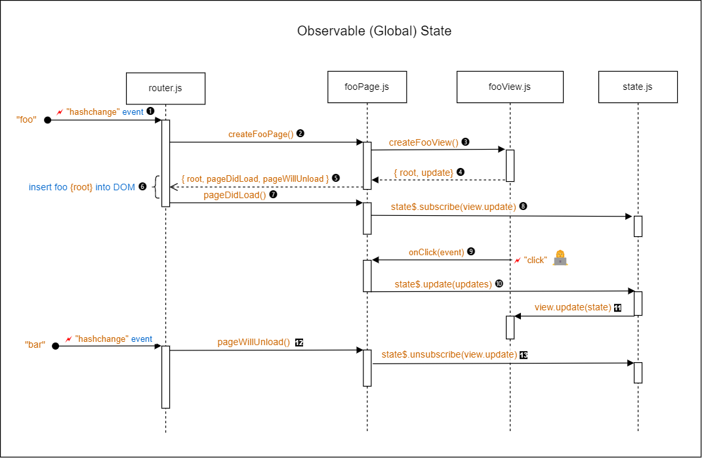

# Observable State

Implementation: [src/lib/observableState.js](src/lib/observableState.js)

## 1. Introduction

The `observableState.js` module from the `lib` enables the sharing of application state across multiple pages. This module implements a concept that we will refer to as Observable State. A Page function can subscribe and unsubscribe the `update()` method of its subordinate View object to an Observable State object. When the Observable State object is updated, the `update()` method of the subscribed View object is called.

## 2. Router/Page/View/State Interactions

The interactions between Router, Page, View and Observable State are illustrated in Figure 1 below. It involves the use of the Life Cycle methods that were discussed in section [2.4 Lifecycle Methods](ROUTER.md/#24-lifecycle-methods) of the Router document.

<br>
Figure 1: **Observable Global State Interactions**

An Observable State object has four method properties, the first three of which are shown in Figure 1:

```js
{
  subscribe: (subscriber: object) => void,
  unsubscribe: (subscriber: object) => void,
  update: (updates: object) => object,
  get: () => object
}
```

Let's focus on the interactions from Figure 1 that are relevant to the Observable State.

<!-- prettier-ignore -->
| Steps | Description |
| :----:| ----------- |
| 5 | In addition to the `root` and `update` properties from the View object, the Page object is now augmented with the `pageDidLoad` and `pageWillUnload` method, implemented as internal functions of the Page function. |
| 8 | Inside the `pageDidLoad` method, the `subscribe` method of the Observable State object is called with the `update` method of the View object as the argument. |
| 10 | When the state needs to be updated, the `update` method of the Observable State object with an object containing just the updates to be made to the state. |
| 11 | Every time the Observable State object is updated, it calls its subscribers, passing the updated state as argument. |
| 12 | When the page is unloaded (i.e. when navigating to another page), the Page unsubscribes the `update()` method of its View so that it no longer receives state updates. |

## 3. Using the Observable State

The recommended practice to create an Observable State object is to create it in a separate file `state.js` at the same level as `app.js` (normally the `src/` folder). Below is canonical way to create an Observable State object. For debugging purposes, the current state is also logged the console every time it is updated. This is done by subscribing the logger to the Observable State object.

It is recommended to use the variable name `state$` for the Observable State object, with the `$` suffix indicating that it is "observable" rather than just a plain JavaScript data object.

```js
// src/state.js
import logger from './lib/logger.js';
import createObservableState from './lib/observableState.js';

const state$ = createObservableState();

// Subscribe to log state changes to the console
state$.subscribe((state) => {
  logger.debug('state', state);
});

export default state$;
```

The function signature for `createObservableState()` is as follows:

```js
createObservableState() => {
  subscribe: (subscriber: Function) => void,
  unsubscribe: (subscriber: Function) => void,
  update: (updates: object) => object,
  get: () => object
}
```

Here is an example of how the Observable State object is used in a Page function:

```js
import router from '../../../lib/router.js';
import fetchRepos from '../fetchers/reposFetcher.js';
import state$ from '../state.js';
import createReposView from '../views/reposView.js';

function createReposPage(props) {
  const [organization = 'HackYourFuture'] = props.params;
  state$.update({ organization });

  // code omitted for brevity

  const reposView = createReposView(viewProps);

  const getData = async () => {
    state$.update({ error: null, loading: true, repos: null });

    try {
      const repos = await fetchRepos(organization);
      state$.update({ repos, loading: false });
    } catch (error) {
      state$.update({ error, loading: false });
      router.navigateTo('error');
      return;
    }
  };

  getData();

  const pageDidLoad = () => {
    state$.subscribe(reposView);
  };

  const pageWillUnload = () => {
    state$.unsubscribe(reposView);
  };

  return { ...reposView, pageDidLoad, pageWillUnload };
}
```

As you can see, the Page subscribes to the observable state when the page is loaded and unsubscribes just before the page is unloaded. The `pageDidLoad` and `pageWillUnload` "lifecycle" functions are called by the router at the appropriate times.

To make these functions available to the router they must be added to the object that is returned by the Page function.
